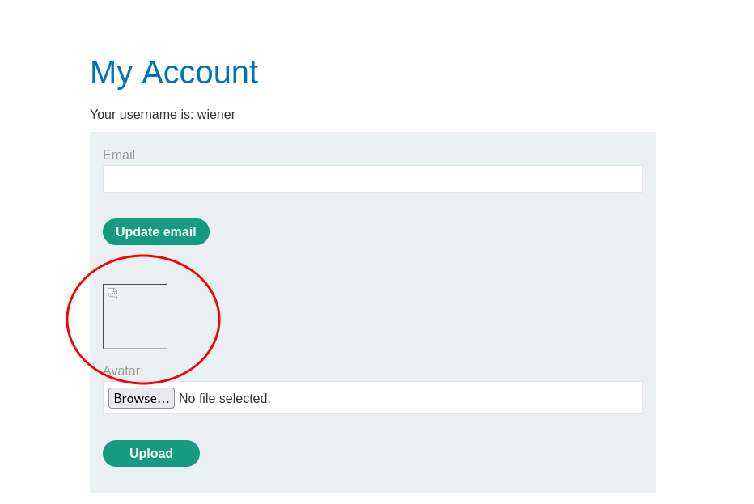

# BSCP PRACTICIONER LAB 1: Lab file upload web shell upload via extension blacklist bypass

Link: https://portswigger.net/web-security/file-upload/lab-file-upload-web-shell-upload-via-extension-blacklist-bypass

----

## Tenemos un file upload en una aplicación web con backend php

----

-----

Se puede subir una reverse shell en la imagen de perfil con un .phar