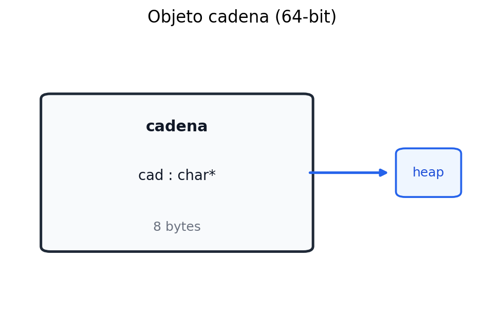
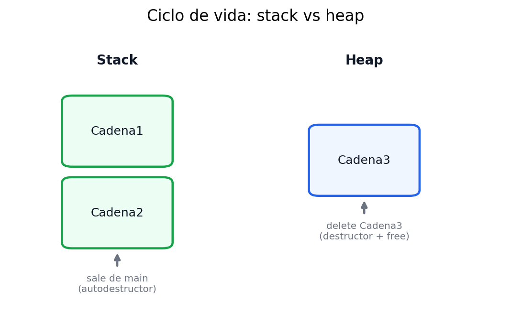
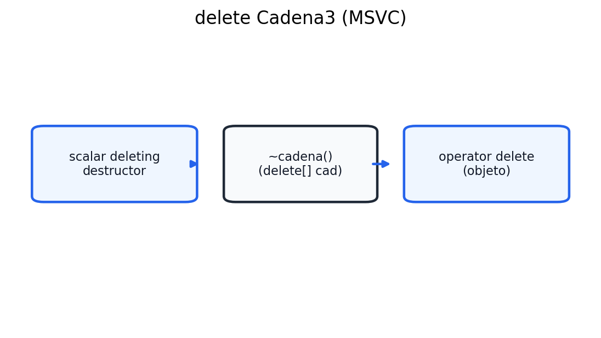
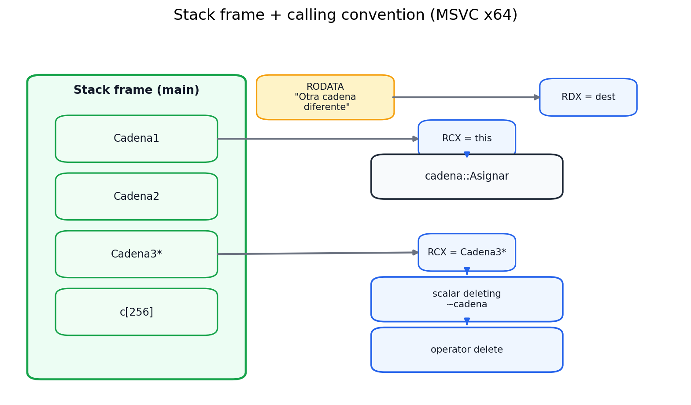

# Constructores y Destructores (C++ Reversing)


## Repaso rápido: public / private / protected

- **private**: acceso solo desde miembros de la misma clase.
- **public**: acceso desde cualquier lugar.
- **protected**: como `private`, pero también accesible desde clases derivadas.

---

## Constructores: definición y reglas

**Definición:** función miembro especial que inicializa un objeto al momento de declararlo.

**Reglas clave:**
- Mismo nombre que la clase.
- Sin tipo de retorno.
- No se heredan.
- Deben ser públicos (si son privados/protegidos no tendría sentido usarlos desde fuera).

**Sintaxis general:**

```cpp
class Nombre {
public:
    Nombre(parametros) : init1(expr), init2(expr) {
        // cuerpo del constructor
    }
};
```

---


### Constructor básico + métodos `Lee` y `Guarda`

```cpp
#include <iostream>
using namespace std;

class pareja {
public:
    // Constructor
    pareja(int a2, int b2);
    // Funciones miembro
    void Lee(int &a2, int &b2);
    void Guarda(int a2, int b2);
private:
    // Datos miembro
    int a, b;
};

pareja::pareja(int a2, int b2) {
    a = a2;
    b = b2;
}

void pareja::Lee(int &a2, int &b2) {
    a2 = a;
    b2 = b;
}

void pareja::Guarda(int a2, int b2) {
    a = a2;
    b = b2;
}

int main() {
    pareja par1(12, 32);
    int x, y;

    par1.Lee(x, y);
    cout << "Valor de par1.a: " << x << endl;
    cout << "Valor de par1.b: " << y << endl;

    return 0;
}
```

---

## Constructor por defecto y el “most vexing parse”

**Declaraciones ilegales si existe constructor con parámetros:**

```cpp
pareja par1;    // ERROR si solo existe pareja(int,int)
pareja par1();  // ERROR: el compilador interpreta esto como prototipo de función
```

**Forma correcta al usar constructor por defecto:**

```cpp
pareja par2;    // Correcto: constructor sin parámetros
```

**Declaraciones válidas con argumentos:**

```cpp
pareja par1(12, 43);
pareja par2(45, 34);
```

---

## Inicialización de miembros (lista de inicialización)

La inicialización en la lista es preferible a asignar dentro del cuerpo:

```cpp
pareja::pareja(int a2, int b2) : a(a2), b(b2) {}
```

---

## Sobrecarga de constructores

Dos constructores con firmas distintas:

```cpp
class pareja {
public:
    pareja(int a2, int b2) : a(a2), b(b2) {}
    pareja() : a(0), b(0) {}
    void Lee(int &a2, int &b2);
    void Guarda(int a2, int b2);
private:
    int a, b;
};
```

---

## Argumentos por defecto

Con valores por defecto se evita sobrecargar:

```cpp
class pareja {
public:
    pareja(int a2 = 0, int b2 = 0) : a(a2), b(b2) {}
    void Lee(int &a2, int &b2);
    void Guarda(int a2, int b2);
private:
    int a, b;
};
```

---

## Asignación de objetos

```cpp
int main() {
    pareja par1(12, 32), par2;
    int x, y;

    par2 = par1;      // Copia de miembros (operador = por defecto)
    par2.Lee(x, y);

    cout << "Valor de par2.a: " << x << endl;
    cout << "Valor de par2.b: " << y << endl;
    return 0;
}
```

---

## Constructor copia

**Definición:**

```cpp
class pareja {
public:
    pareja(int a2 = 0, int b2 = 0) : a(a2), b(b2) {}
    pareja(const pareja &p); // Constructor copia
    void Lee(int &a2, int &b2);
    void Guarda(int a2, int b2);
private:
    int a, b;
};

pareja::pareja(const pareja &p) : a(p.a), b(p.b) {}
```

**Uso directo:**

```cpp
int main() {
    pareja par1(12, 32);
    pareja par2(par1); // Constructor copia
    int x, y;

    par2.Lee(x, y);
    cout << "Valor de par2.a: " << x << endl;
    cout << "Valor de par2.b: " << y << endl;
    return 0;
}
```

**Uso con inicialización por igualdad:**

```cpp
pareja par2 = par1; // También llama al constructor copia
```

**Caso curioso con conversión implícita:**

```cpp
pareja par2 = 14; // Se crea un temporal con pareja(14) y luego se copia
```

---

## Reversing: analisis del asm del video (MSVC x64)

### Convencion de llamada y shadow space

- **RCX** = primer argumento (en metodos: `this`).
- **RDX, R8, R9** = siguientes argumentos.
- **Shadow space**: 32 bytes reservados por el caller. MSVC "homea" los registros ahi:
  - `this$ = 8`, `a2$ = 16`, `b2$ = 24`

> En IDA muchas veces **no aparece `this`** en el prototipo, pero siempre viaja en RCX.
> En el callee, `RSP` apunta al return address, por eso el shadow space se ve desde `rsp+8`.

---

### Layout de la clase `pareja`

Dos `int` => **8 bytes**:

```
offset 0x00 -> a
offset 0x04 -> b
```

Se confirma por los accesos `[rax]` y `[rax+4]`.

**Idea clave:** como en structs, **solo los datos ocupan memoria**. Los metodos no suman bytes.

---

### Constructor: `pareja::pareja(int,int)`

```asm
this$ = 8
a2$   = 16
b2$   = 24
pareja::pareja(int,int) PROC
    mov     DWORD PTR [rsp+24], r8d   ; b2 (home)
    mov     DWORD PTR [rsp+16], edx   ; a2 (home)
    mov     QWORD PTR [rsp+8], rcx    ; this (home)

    mov     rax, QWORD PTR this$[rsp]
    mov     ecx, DWORD PTR a2$[rsp]
    mov     DWORD PTR [rax], ecx      ; this->a = a2

    mov     rax, QWORD PTR this$[rsp]
    mov     ecx, DWORD PTR b2$[rsp]
    mov     DWORD PTR [rax+4], ecx    ; this->b = b2

    mov     rax, QWORD PTR this$[rsp]
    ret     0
pareja::pareja(int,int) ENDP
```

**Puntos clave del instructor:**
- Primero guarda los argumentos en el shadow space y despues opera desde ahi.
- `this` es un puntero al objeto en stack.
- Aunque el constructor no retorna nada en C++, MSVC deja `this` en `RAX`.

---

### Metodo por referencia: `void pareja::Lee(int &, int &)`

```asm
this$ = 8
a2$   = 16
b2$   = 24
void pareja::Lee(int &,int &) PROC
    mov     QWORD PTR [rsp+24], r8    ; &b2 (home)
    mov     QWORD PTR [rsp+16], rdx   ; &a2 (home)
    mov     QWORD PTR [rsp+8], rcx    ; this (home)

    mov     rax, QWORD PTR a2$[rsp]   ; rax = &a2
    mov     rcx, QWORD PTR this$[rsp] ; rcx = this
    mov     ecx, DWORD PTR [rcx]      ; ecx = this->a
    mov     DWORD PTR [rax], ecx      ; *a2 = a

    mov     rax, QWORD PTR b2$[rsp]   ; rax = &b2
    mov     rcx, QWORD PTR this$[rsp]
    mov     ecx, DWORD PTR [rcx+4]    ; ecx = this->b
    mov     DWORD PTR [rax], ecx      ; *b2 = b
    ret     0
void pareja::Lee(int &,int &) ENDP
```

**Lectura rapida:**
- Como `a2` y `b2` son referencias, se pasan **punteros**.
- Por eso aparecen escrituras indirectas `mov [rax], ecx`.

---

### Metodo por valor: `void pareja::Guarda(int,int)`

```asm
void pareja::Guarda(int,int) PROC
    mov     DWORD PTR [rsp+24], r8d   ; b2 (home)
    mov     DWORD PTR [rsp+16], edx   ; a2 (home)
    mov     QWORD PTR [rsp+8], rcx    ; this (home)

    mov     rax, QWORD PTR this$[rsp]
    mov     ecx, DWORD PTR a2$[rsp]
    mov     DWORD PTR [rax], ecx      ; this->a = a2

    mov     rax, QWORD PTR this$[rsp]
    mov     ecx, DWORD PTR b2$[rsp]
    mov     DWORD PTR [rax+4], ecx    ; this->b = b2
    ret     0
void pareja::Guarda(int,int) ENDP
```

**Nota:** es practicamente igual al constructor, solo que se llama manualmente.

---

### `main`: stack, llamadas y strings

```asm
x$   = 32
y$   = 36
par1$= 40
main PROC
    sub     rsp, 56             ; 0x38
    mov     r8d, 32             ; b2
    mov     edx, 12             ; a2
    lea     rcx, QWORD PTR par1$[rsp] ; this = &par1
    call    pareja::pareja(int,int)

    lea     r8,  QWORD PTR y$[rsp]    ; &y
    lea     rdx, QWORD PTR x$[rsp]    ; &x
    lea     rcx, QWORD PTR par1$[rsp] ; this
    call    void pareja::Lee(int &,int &)
    ; ... cout << "Valor de par1.a: " << x << endl
    ; ... cout << "Valor de par1.b: " << y << endl
    add     rsp, 56
    ret     0
main ENDP
```

**Mapa rapido del stack en `main`:**

```
rsp+00h .. rsp+1Fh -> shadow space
rsp+20h           -> x (int)
rsp+24h           -> y (int)
rsp+28h           -> par1.a (int)
rsp+2Ch           -> par1.b (int)
```

**Strings y cout:**
- `$SG35296` = "Valor de par1.a: "
- `$SG35297` = "Valor de par1.b: "
- `std::operator<<` devuelve `cout` en `RAX` para encadenar `<<`.

**Nota de stack:** `sub rsp, 0x38` = `0x20` (shadow) + `0x18` (locals + padding/alineacion).

---

### Checklist rapido para identificar clases en asm

- `lea rcx, [rsp+X]` seguido de `call sub_xxx`: probable constructor.
- Accesos `[rcx]`, `[rcx+4]`, etc. revelan offsets de campos.
- Si ves `mov [rax], ecx` con `rax` cargado desde un argumento, es **referencia**.

---

### Apendice: Acceso a la información mediante punteros y ownership


**Objetivo:** comparar dos formas de "guardar" el estado leído del objeto:

- **Alias (non-owning):** punteros que apuntan a `x` e `y`. Si `x/y` cambian, el alias ve el cambio.
- **Ownership (owning copy):** `unique_ptr<int>` crea **copias en heap** de `x` e `y`. Si `x/y` cambian luego, la copia queda intacta.

**Idea clave:** el ownership no es sobre la variable original, sino sobre **memoria propia** reservada para guardar una copia.


```cpp
#include <iostream>
#include <memory>
using namespace std;

class pareja {
public:
    pareja(int a2, int b2);
    void Lee(int& a2, int& b2);
    void Guarda(int a2, int b2);
private:
    int a, b;
};

pareja::pareja(int a2, int b2) {
    a = a2;
    b = b2;
}

void pareja::Lee(int& a2, int& b2) {
    a2 = a;
    b2 = b;
}

void pareja::Guarda(int a2, int b2) {
    a = a2;
    b = b2;
}

int main() {
    pareja par1(12, 32);
    int x, y;

    // Leer valores desde el objeto
    par1.Lee(x, y);
    cout << "Valor de par1.a: " << x << endl;
    cout << "Valor de par1.b: " << y << endl;
    cout << "------------------------" << endl;

    // 1) Non-owning pointers (alias): apuntan a x e y
    int* px_alias = &x;
    int* py_alias = &y;
    cout << "Alias: *px_alias = " << *px_alias << ", *py_alias = " << *py_alias << endl;

    // 2) Owning pointers (preservan valores originales) con smart pointers
    auto px_saved = make_unique<int>(x);
    auto py_saved = make_unique<int>(y);
    cout << "Saved (smart pointers): *px_saved = " << *px_saved << ", *py_saved = " << *py_saved << endl;

    // Cambiamos los valores del objeto
    cout << "Guardando nuevos valores en par1..." << endl;
    par1.Guarda(45, 67);

    // Leemos de nuevo en x,y (estos cambian)
    par1.Lee(x, y);
    cout << "Nuevos valores de par1: " << x << ", " << y << endl;

    // Mostrar cómo se comportan las dos aproximaciones
    cout << "Alias después del cambio: *px_alias = " << *px_alias << ", *py_alias = " << *py_alias << endl;
    cout << "Saved (inmutable) después del cambio: *px_saved = " << *px_saved << ", *py_saved = " << *py_saved << endl;

    return 0;
}
```

### Relacion con reversing

- **Alias:** en asm veras solo **direcciones** que apuntan al stack (`lea rdx, [rsp+...]`).
- **Ownership:** apareceran llamadas a `operator new`/`delete` (o runtime) porque hay reserva en heap.
- Cuando el `unique_ptr` sale de scope, veras el cleanup al final de `main`.

---

### Decompilado IDA: `this` explicito y paso de parametros

En el decompilado de IDA, los metodos de C++ se ven como funciones normales con el
puntero `this` **explicito** como primer parametro:

```cpp
void __fastcall pareja::Lee(pareja *this, int *a2, int *b2)
{
  *a2 = this->a;
  *b2 = this->b;
}
```

**Claves:**

- El compilador **siempre pasa `this` como primer parametro** (en x64 MSVC va en `RCX`).
- IDA lo muestra como si fuera un argumento normal (`pareja *this`), aunque en C++
  no se escribe en el prototipo.
- Las referencias (`int&`) se ven como **punteros** (`int *`) porque a bajo nivel eso son.
- En `main`, las llamadas aparecen como `pareja::Lee(&par1, &x, &y)`: el primer
  argumento es `this` y los otros son los parametros reales.

**Con smart pointers:**

- En el decompilado aparecen `std::make_unique` y los destructores
  `std::unique_ptr<int>::~unique_ptr`, lo cual confirma la reserva y liberacion en heap.

---

## Destructores

- El destructor tiene el mismo nombre de la clase con `~`.
- Se ejecuta cuando el objeto sale de ámbito.

**Definición:** método especial que se ejecuta cuando un objeto termina su vida útil. Se usa para liberar recursos (memoria dinámica, archivos, handles, sockets, etc).

**Reglas clave:**
- Mismo nombre que la clase, precedido por `~` (tilde en inglés).
- Sin valor de retorno.
- **No tiene parámetros** → por eso **no se sobrecarga**.
- No se hereda.
- Debe ser público.
- Se llama **automáticamente** al salir del ámbito (stack), o cuando se invoca `delete` para objetos creados con `new`.

**Cuándo es crítico definirlo:** cuando la clase administra recursos (punteros, memoria dinámica, handles, etc).

---

## Código base

```cpp
#include <iostream>
#include <cstring>
using namespace std;

class cadena {
  public:
   cadena();        // Constructor por defecto
   cadena(const char *c); // Constructor desde cadena c
   cadena(int n);   // Constructor de cadena de n caracteres
   cadena(const cadena &);   // Constructor copia
   ~cadena();       // Destructor

   void Asignar(const char *dest); // Asigna nueva cadena
   char *Leer(char *c);
  private:
   char *cad;       // Puntero a char: cadena de caracteres
};

cadena::cadena() : cad(NULL) {} // Constructor por defecto


// Constructor desde cadena c
cadena::cadena(const char *c) {
   cad = new char[strlen(c)+1];
   strcpy(cad, c);
}

// Constructor de cadena de n caracteres
cadena::cadena(int n) {
   cad = new char[n+1];
   cad[0] = 0;
}

// Constructor copia
cadena::cadena(const cadena &Cad) {
   cad = new char[strlen(Cad.cad)+1];
   strcpy(cad, Cad.cad);
}


// Destructor
cadena::~cadena() {
   delete[] cad;
}


// METODO: Asigna nueva cadena
void cadena::Asignar(const char *dest) {
   delete[] cad;
   cad = new char[strlen(dest)+1];
   strcpy(cad, dest);
}


// METODO: Leer cadena
char *cadena::Leer(char *c) {
   strcpy(c, cad);
   return c;
}

int main() {
   cadena Cadena1("Cadena de prueba");
   cadena Cadena2(Cadena1);   // copia
   cadena *Cadena3;           // puntero
   char c[256];

   Cadena1.Asignar("Otra cadena diferente");
   Cadena3 = new cadena("Cadena de prueba nº 3");

   cout << "Cadena 1: " << Cadena1.Leer(c) << endl;
   cout << "Cadena 2: " << Cadena2.Leer(c) << endl;
   cout << "Cadena 3: " << Cadena3->Leer(c) << endl;

   delete Cadena3;  // destructor + delete
   return 0;
}
```


## Apéndice: `strcpy` marcado como inseguro, MSVC requiere `strcpy_s`

En versiones recientes de MSVC, `strcpy` está marcado como inseguro y genera advertencias. Se recomienda usar `strcpy_s`, que requiere el tamaño del buffer destino para prevenir desbordamientos.

### El problema con `strcpy`

```cpp
char *cadena::Leer(char *c) {
    strcpy(c, cad);  // WARNING C4996: 'strcpy': This function or variable may be unsafe
    return c;
}
```

`strcpy` no valida el tamaño del buffer destino, permitiendo buffer overflows.

### Solución: usar `strcpy_s`

```cpp
char *cadena::Leer(char *c) {
    strcpy_s(c, 256, cad);  // Especifica tamaño máximo: 256 bytes
    return c;
}
```

### Cambios en los constructores

```cpp
cadena::cadena(const char *c) {
    cad = new char[strlen(c)+1];
    strcpy_s(cad, strlen(c)+1, c);  // Tamaño: strlen(c)+1
}

cadena::cadena(const cadena &Cad) {
    cad = new char[strlen(Cad.cad)+1];
    strcpy_s(cad, strlen(Cad.cad)+1, Cad.cad);
}

void cadena::Asignar(const char *dest) {
    delete[] cad;
    cad = new char[strlen(dest)+1];
    strcpy_s(cad, strlen(dest)+1, dest);
}
```

### Sintaxis de `strcpy_s`

```cpp
errno_t strcpy_s(char *dest, size_t destSize, const char *src);
```

- **Retorna 0** si la copia es exitosa.
- **Retorna error code** si hay problema (ej: buffer insuficiente).

### Reversing: impacto en ASM

Con `strcpy_s`, el compilador agrega validaciones en tiempo de ejecución. En el ASM verás:

- Un argumento adicional (tamaño del buffer) pasado a `strcpy_s`.
- Posibles calls a `__report_gsfailure` si detecta overflow.
- Mayor tamaño de código debido a las comprobaciones de seguridad.


---

## Reversing: ideas clave (MSVC x64)

### Tamaño del objeto
`class cadena` solo tiene un `char *cad`, por lo tanto el **tamaño del objeto es 8 bytes** (puntero de 64-bit).



### Constructor por defecto
```asm
mov rax, [this]
mov qword ptr [rax], 0
```
Deja `cad = NULL`.

### Constructor desde `char*`
Secuencia típica:
1) `strlen(c)`  
2) `+1`  
3) `operator new[]`  
4) guardar puntero en `cad`  
5) `strcpy(cad, c)`

```asm
call strlen
inc  rax
call operator new[]
mov  [this->cad], rax
call strcpy
```

### Constructor `int n`
Reserva `n+1` y fuerza `cad[0]=0`:
```asm
call operator new[]
mov [this->cad], rax
mov byte ptr [rax], 0
```

### Constructor copia (deep copy)
No copia el puntero, **copia el contenido**:
1) `strlen(Cad.cad)+1`
2) `new[]`
3) `strcpy`

```asm
mov rcx, [Cad->cad]
call strlen
inc rax
call operator new[]
mov [this->cad], rax
mov rdx, [Cad->cad]
mov rcx, [this->cad]
call strcpy
```

### Destructor
Siempre libera el heap reservado:
```asm
mov rcx, [this->cad]
call operator delete[]
```

---

## Reversing: flujo en `main`

1) `Cadena1` (stack) → ctor `char*`  
2) `Cadena2` (stack) → ctor copia  
3) `Cadena1.Asignar()` → `delete[]` + `new[]` + `strcpy`  
4) `Cadena3` (heap) → `operator new` + ctor `char*`  
5) `Leer()` devuelve puntero `c` (buffer) luego imprime  
6) `delete Cadena3` → llama **scalar deleting destructor** → destructor → `delete`  
7) Salida de `main` → destructores automáticos para `Cadena2` y `Cadena1`.



En MSVC se ve el patrón:

```asm
mov ecx, 8
call operator new
call cadena::cadena(char const*)
...
mov edx, 1
call cadena::`scalar deleting destructor'(unsigned int)
```

El flag `edx=1` indica que además del destructor se debe liberar la memoria del objeto.



---

## Stack frame + `this` (convención MSVC x64)



---

## Observaciones útiles al reversing

- **`delete` no solo libera memoria:** primero llama al destructor y luego al `operator delete`.  
- **Copia segura:** el constructor copia hace *deep copy* (no comparte punteros).  
- **Cadena3:** al ser heap, **se destruye solo si llamás `delete`**.  
- **Cadena1/Cadena2:** al ser stack, el compilador llama al destructor al salir de `main`.  
- **Security cookie:** MSVC agrega `__security_cookie` y `__security_check_cookie` cuando hay buffers en stack (`char c[256]`).  
- En algunos builds el compilador **puede** insertar un `memset`/zero-init del objeto antes del constructor si detecta punteros; en este listing no aparece explícito, pero es común en builds con seguridad extra.
- En el string `"Cadena de prueba nº 3"` aparece en data como bytes `0xC2 0xBA` (UTF-8 de `º`), y en asm se ve como:
  ```
  $SG35309 DB 'Cadena de prueba n', 0c2H, 0baH, ' 3', 00H
  ```

---

## Mini-mapa del ASM (referencia rápida)

- `$SG35306` → `"Cadena de prueba"`
- `$SG35307` → `"Otra cadena diferente"`
- `$SG35309` → `"Cadena de prueba nº 3"`
- `cadena::cadena(char const*)` → `strlen + new[] + strcpy`
- `cadena::~cadena` → `delete[] cad`
- `cadena::Asignar` → `delete[]` + `new[]` + `strcpy`
- `cadena::Leer` → `strcpy` y retorna `c`

## ANALISIS IDA

Observación (ASM MSVC):
- `delete Cadena3` invoca el `scalar deleting destructor` con `edx=1`, lo que combina
  destructor + liberación del heap.
- Los objetos en stack (`Cadena2`, `Cadena1`) no se liberan con `delete`; el compilador
  **inserta** llamadas explícitas al destructor al final de `main`, en orden inverso
  a la construcción.
- Se ve `__security_cookie` por el buffer local `char c[256]`.
 - Se ve `__autoclassinit2` antes de cada ctor en `main`: es un `memset` a cero del
  objeto (size=8) que deja `cad=NULL` antes del constructor real.

### Diferencias entre el decompilado y el código fuente (por qué aparecen helpers)

Breve comparación con el fuente del ejercicio: el decompilado muestra llamadas y helpers que el C++ “oculta”, pero que MSVC materializa en asm.

- **`__autoclassinit2` aparece antes de cada ctor**: en el binario es un wrapper que hace `memset(this, 0, 8)` (size del objeto) para dejar `cad = NULL` antes del constructor real. Es una inicialización extra del compilador, no está en el fuente C++ (y no reemplaza al ctor). Esto explica por qué ves la llamada aunque el código no tenga `memset` explícito.[`cadena::__autoclassinit2()`](docs/bin-exploitation/binary-gecko-academy/cpp-reversing/constructors-destructors.md:780)
- **`scalar deleting destructor` con flag**: `delete Cadena3` no llama directo a `~cadena`, sino a un wrapper MSVC que: (1) llama al destructor, (2) si `a2 & 1` libera el objeto con `operator delete`. En el decompilado aparece `edx=1` para indicar “destruir + free”. El fuente solo dice `delete`, pero en asm se desdobla.[`cadena::`scalar deleting destructor``](docs/bin-exploitation/binary-gecko-academy/cpp-reversing/constructors-destructors.md:787)
- **`strcpy_s` y tamaños calculados**: el fuente usa `strcpy_s`, por eso en el decompilado aparecen `strlen` y el `SizeInBytes` explícito antes de copiar. Esto es coherente con MSVC y la variante segura (no es un cambio lógico, es la expansión explícita del helper).[`cadena::Leer()`](docs/bin-exploitation/binary-gecko-academy/cpp-reversing/constructors-destructors.md:780)
- **`__security_cookie` por el buffer local**: el `char c[256]` dispara el prolog/epilog de seguridad; no es “limpieza” del heap ni del miembro `cad`. Es mitigación de stack, por eso está alrededor de `main`.[`__security_cookie`](docs/bin-exploitation/binary-gecko-academy/cpp-reversing/constructors-destructors.md:787)

### Flujo real en `main` (reconciliado)

1) `Cadena1` y `Cadena2` (stack) se inicializan con `__autoclassinit2` + ctor.  
2) `Cadena3` (heap) se crea con `operator new` + ctor; el puntero se guarda en local.  
3) Al final: `delete Cadena3` → wrapper `scalar deleting destructor` (`edx=1`) → `~cadena` → `operator delete`.  
4) Luego, destructores automáticos de `Cadena2` y `Cadena1` en orden inverso de construcción.  

Esto explica la diferencia visual entre “código limpio” y el decompilado: el compilador desdobla `delete`, agrega init/zeroing del objeto y protección de stack que el C++ no muestra.

## Decompiler vs codigo real comparativa

**Contexto:** estas piezas vienen de IDA con variables renombradas y comentarios agregados para que el flujo sea más legible. Las firmas son MSVC x64 (`this` explícito en `RCX`).

### `cadena::cadena(const char* c)` (ctor desde C-string)

```cpp
void __fastcall cadena::cadena(cadena *this, const char *c)
{
  size_t src_len; // rax
  size_t bytes; // [rsp+28h]

  src_len = strlen_0(c);
  this->cad = (char *)operator new[](src_len + 1);
  bytes = strlen_0(c) + 1;
  strcpy_s(this->cad, bytes, c); // MSVC usa variante segura con size calculado
}
```

**Qué no ves en el C++:** el `strcpy_s` y el tamaño explícito aparecen porque el compilador “abre” la llamada segura; el fuente solo dice `strcpy_s(cad, strlen(c)+1, c)`.

### `cadena::cadena(const cadena& Cad)` (ctor copia)

```cpp
void __fastcall cadena::cadena(cadena *this, const cadena *Cad)
{
  size_t src_len; // rax
  const char *src_ptr; // [rsp+28h]
  size_t bytes; // [rsp+30h]

  src_len = strlen_0(Cad->cad);
  this->cad = (char *)operator new[](src_len + 1);
  src_ptr = Cad->cad;
  bytes = strlen_0(Cad->cad) + 1;
  strcpy_s(this->cad, bytes, src_ptr); // deep copy
}
```

**Lectura reverser:** el ctor copia no copia punteros; reserva memoria nueva y copia el contenido (*deep copy*).

### `cadena::~cadena()` (dtor real)

```cpp
void __fastcall cadena::~cadena(cadena *this)
{
  operator delete(this->cad); // en el binario se ve como delete/delete[] según runtime
}
```

**Importante:** el destructor no libera `this`, solo el buffer interno. La liberación del objeto completo ocurre en el wrapper de `delete`.

### `cadena::`scalar deleting destructor`` (wrapper de delete)

```cpp
cadena *__fastcall cadena::`scalar deleting destructor'(cadena *this, char a2)
{
  cadena::~cadena(this);
  if ( (a2 & 1) != 0 )
    operator delete(this);
  return this;
}
```

**Por qué aparece:** `delete Cadena3` se traduce a este wrapper; el flag (`a2=1`) indica “destruir + free”.

### `cadena::Asignar(const char* dest)`

```cpp
void __fastcall cadena::Asignar(cadena *this, const char *dest)
{
  size_t src_len; // rax
  size_t bytes; // [rsp+30h]

  operator delete(this->cad);
  src_len = strlen_0(dest);
  this->cad = (char *)operator new[](src_len + 1); // reemplaza buffer previo
  bytes = strlen_0(dest) + 1;
  strcpy_s(this->cad, bytes, dest);
}
```

**Diferencia clave vs fuente:** el binario explicita la política “liberar y reasignar” en heap; no hay magia de strings.

### `cadena::Leer(char* c)`

```cpp
char *__fastcall cadena::Leer(cadena *this, char *c)
{
  const char *src_ptr; // [rsp+20h]
  size_t bytes; // [rsp+28h]

  src_ptr = this->cad;
  bytes = strlen_0(this->cad) + 1;
  strcpy_s(c, bytes, src_ptr); // copia a buffer caller
  return c;
}
```

**Detalle:** el tamaño se calcula con `strlen(cad)+1`, por eso el `strcpy_s` siempre lleva `bytes`.

### `cadena::__autoclassinit2` (helper de init)

```cpp
void __fastcall cadena::__autoclassinit2(cadena *this, unsigned __int64 a2)
{
  memset(this, 0, a2); // zero-init helper (size=8)
}
```

**Qué explica:** esta llamada aparece antes de cada ctor en `main` para dejar `cad=NULL` incluso antes del constructor; es una decisión del compilador, no del código fuente.
