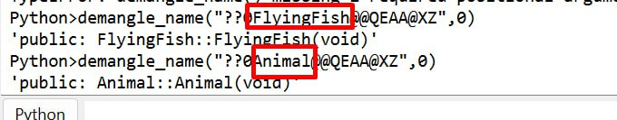

# Next-Gen Reverse Engineering Training
## Módulo 3: C / C++ Reversing — Parte II

> **Objetivo del módulo:** Comprender las características avanzadas de C++ que aparecen frecuentemente al analizar binarios en un desensamblador (IDA Pro, Ghidra, x64dbg). Reconocer los patrones que genera el compilador para cada construcción del lenguaje es clave para el reversing.

---

## Tabla de Contenidos

1. [Namespaces](#1-namespaces)
2. [Sobrecarga de Operadores](#2-sobrecarga-de-operadores)
3. [Herencia Simple](#3-herencia-simple)
4. [Métodos Virtuales y vftable](#4-métodos-virtuales-y-vftable)
5. [Herencia Múltiple](#5-herencia-múltiple)
6. [Herencia Virtual y vbtable](#6-herencia-virtual-y-vbtable)
7. [Gestión de Archivos](#7-gestión-de-archivos)
8. [Polimorfismo](#8-polimorfismo)
9. [Polimorfismo Dinámico](#9-polimorfismo-dinámico)
10. [Polimorfismo Estático — Plantillas de Función](#10-polimorfismo-estático--plantillas-de-función)
11. [Polimorfismo Estático — Plantillas de Clase](#11-polimorfismo-estático--plantillas-de-clase)
12. [Operadores de Casting](#12-operadores-de-casting)
13. [Excepciones en C++](#13-excepciones-en-c)
14. [Rebase del Image Base en IDA Pro](#14-rebase-del-image-base-en-ida-pro)
15. [Apéndice A — Slide de Práctica](#apéndice-a--slide-de-práctica)
16. [Apéndice B — FLIRT Signatures y Carga de PDB Genérico para Local Types](#apéndice-b--flirt-signatures-y-carga-de-pdb-genérico-para-local-types)
17. [Apéndice C — Jugando con `demangle_name` en IDAPython](#apéndice-c--jugando-con-demangle_name-en-idapython)

---

## 1. Namespaces

### ¿Qué es un namespace?

Un **namespace** es una región declarativa que agrupa identificadores (variables, funciones, clases, objetos) bajo un nombre común. Su propósito principal es **evitar conflictos de nombres** cuando se trabaja con múltiples bibliotecas o proyectos grandes.

Sin namespaces, si dos bibliotecas definen una función llamada `log()`, el compilador no sabría cuál usar. Con namespaces, se distingue con `LibA::log()` vs `LibB::log()`.

### Tipos de namespaces

| Tipo | Descripción |
|---|---|
| **Definido por el usuario** | Creado por el desarrollador para agrupar su propio código |
| **Estándar (`std`)** | Provisto por la STL (Standard Template Library) |
| **Anónimo** | Sin nombre, limita el alcance al archivo actual (equivale a `static` en C) |

### Namespace definido por el usuario

```cpp
#include <iostream>
using namespace std;

namespace Math {
    int add(int a, int b) {
        return a + b;
    }

    int subtract(int a, int b) {
        return a - b;
    }
}

int main() {
    // Para acceder a funciones dentro de un namespace se usa el operador ::
    int result = Math::add(3, 4);
    cout << "3 + 4 = " << result << endl;          // 3 + 4 = 7
    cout << "10 - 3 = " << Math::subtract(10, 3) << endl; // 10 - 3 = 7
    return 0;
}
```

### Namespace estándar (`std`)

La directiva `using namespace std;` evita tener que escribir `std::` antes de cada elemento estándar. Sin embargo, en proyectos grandes **no es recomendable** porque puede introducir exactamente el tipo de conflictos que los namespaces buscan evitar.

```cpp
#include <iostream>
#include <string>
#include <vector>

int main() {
    // Sin "using namespace std", se debe calificar todo explícitamente
    std::string name;
    std::cout << "Enter your name: ";
    std::getline(std::cin, name);

    std::vector<int> numbers;
    int count;

    std::cout << "\nHow many numbers do you want to enter? ";
    std::cin >> count;

    std::cout << "Enter " << count << " numbers separated by spaces:\n";
    for (int i = 0; i < count; ++i) {
        int num;
        std::cin >> num;
        numbers.push_back(num);
    }

    std::cout << "My first number is: " << numbers[0] << "\n";

    std::cout << "\nHello, " << name << "!\n";
    std::cout << "Your numbers are: ";
    for (int num : numbers) {
        std::cout << num << " ";
    }
    std::cout << "\n";
    return 0;
}
```

### Relevancia en Reversing

En un binario compilado, los namespaces **no existen en tiempo de ejecución**. El compilador incorpora el nombre del namespace en el nombre de la función mediante un proceso llamado **name mangling**. Por ejemplo, `Math::add(int, int)` puede verse como `_ZN4Math3addEii` en el símbolo del binario. Herramientas como `c++filt` pueden desmanglarlo de vuelta a su forma legible.

---

## 2. Sobrecarga de Operadores

### Concepto

La **sobrecarga de operadores** permite redefinir el comportamiento de operadores del lenguaje (`+`, `-`, `*`, `==`, `<`, `[]`, etc.) cuando se aplican a tipos definidos por el usuario (clases/structs). El compilador traduce expresiones como `a == b` en llamadas a funciones especiales.

### ¿Por qué importa en Reversing?

Cuando ves en un desensamblador una llamada a una función con nombre como `operator==`, `operator+`, o `operator[]`, sabés que estás frente a un operador sobrecargado. Reconocer esto ayuda a reconstruir la lógica del programa original.

### Ejemplo — Operador `==` sobrecargado para validar una clave

```cpp
#include <iostream>
#include <string>

class KeyChecker {
private:
    std::string secret;

public:
    // Constructor: inicializa el secreto como "W1llY21" (7 * 3 = 21)
    KeyChecker() : secret("W1llY" + std::to_string(7 * 3)) {}

    // Sobrecarga del operador ==
    // Permite escribir: if (checker == "alguna_clave")
    bool operator==(const std::string& input) {
        return input == secret;
    }
};

int main(int argc, char* argv[]) {
    std::cout << "Find the hidden key!" << std::endl;

    if (argc != 2) {
        std::cout << "Usage: " << argv[0] << " <key>" << std::endl;
        return 1;
    }

    KeyChecker checker;

    // Aquí se llama internamente a KeyChecker::operator==(string)
    if (checker == argv[1]) {
        std::cout << "Correct! Flag: {0p_0v3rl04d_1s_FUN}" << std::endl;
    } else {
        std::cout << "Wrong key!" << std::endl;
    }

    return 0;
}
```

**Punto clave:** En el binario, la comparación `checker == argv[1]` se traduce en una llamada a `KeyChecker::operator==(std::string const&)`. Un analista que ve esta llamada puede deducir que hay una comparación de cadenas contra un valor interno.

### Operadores que se pueden sobrecargar

| Categoría | Operadores |
|---|---|
| Aritméticos | `+` `-` `*` `/` `%` |
| Comparación | `==` `!=` `<` `>` `<=` `>=` |
| Asignación | `=` `+=` `-=` `*=` `/=` |
| Acceso | `[]` `->` `*` |
| Flujo | `<<` `>>` (muy comunes con `cout`/`cin`) |
| Otros | `()` `++` `--` `new` `delete` |

---

## 3. Herencia Simple

### Concepto

La **herencia** es un mecanismo de la POO que permite crear una nueva clase (**clase derivada**) basada en una clase existente (**clase base**). La clase derivada hereda los atributos y métodos públicos y protegidos de la base, y puede agregar los suyos propios o modificar los existentes.

### Modificadores de acceso en herencia

| Herencia | `public` de base | `protected` de base | `private` de base |
|---|---|---|---|
| `public` | `public` | `protected` | inaccesible |
| `protected` | `protected` | `protected` | inaccesible |
| `private` | `private` | `private` | inaccesible |

### Ejemplo

```cpp
#include <iostream>
using namespace std;

class Animal { // Clase base
public:
    string name;

    Animal(string n) : name(n) {}

    void eat() {
        cout << name << " is eating..." << endl;
    }

    void breathe() {
        cout << name << " is breathing..." << endl;
    }
};

class Dog : public Animal { // Clase derivada
public:
    Dog(string n) : Animal(n) {} // Llama al constructor de la clase base

    void bark() {
        cout << name << " says: Woof!" << endl;
    }
};

int main() {
    Dog d("Rex");
    d.eat();     // Heredado de Animal → "Rex is eating..."
    d.breathe(); // Heredado de Animal → "Rex is breathing..."
    d.bark();    // Propio de Dog     → "Rex says: Woof!"
    return 0;
}
```

### Relevancia en Reversing

En un binario, cuando ves que un constructor llama a otro constructor antes de ejecutar su propio código de inicialización, muy probablemente estás viendo herencia. El compilador siempre llama al constructor de la clase base **antes** que al de la clase derivada, y al destructor de la base **después** que al de la derivada.

---

## 4. Métodos Virtuales y vftable

### Concepto

Un **método virtual** es una función declarada con la palabra clave `virtual` en la clase base. Permite que las clases derivadas **sobreescriban** esa función y que la versión correcta se seleccione en **tiempo de ejecución** según el tipo real del objeto, no según el tipo del puntero.

Sin `virtual`, la resolución es en tiempo de compilación (enlace estático). Con `virtual`, es en tiempo de ejecución (enlace dinámico).

### La vftable (Virtual Function Table)

Este es uno de los conceptos **más importantes para el reversing de C++**.

Cuando una clase declara al menos una función virtual, el compilador genera automáticamente una **vftable** (tabla de funciones virtuales) para esa clase. Es una tabla estática que contiene punteros a las implementaciones de cada función virtual.

Cada **objeto** de esa clase contiene, como primer miembro oculto, un puntero llamado `__vptr` (o `vfptr`) que apunta a la vftable de su clase real.

```
Objeto en memoria:
┌─────────────┐
│  __vptr     │──→  vftable de Dog
├─────────────┤         ┌──────────────────┐
│  name       │         │ ptr → Dog::eat   │
├─────────────┤         │ ptr → Dog::sleep │
│  ...        │         │ ptr → ~Dog       │
└─────────────┘         └──────────────────┘
```

### Ejemplo completo

```cpp
#include <iostream>
using namespace std;

class Animal {
public:
    virtual void eat()  { cout << "Animal is eating..."   << endl; }
    virtual void sleep(){ cout << "Animal is sleeping..." << endl; }
    virtual ~Animal()   {}  // Destructor virtual: SIEMPRE necesario si hay herencia
};

class Dog : public Animal {
public:
    void eat()   override { cout << "Dog is eating..."   << endl; }
    void sleep() override { cout << "Dog is sleeping..." << endl; }
    void bark()           { cout << "Dog is barking..."  << endl; } // No virtual
};

class Cat : public Animal {
public:
    void eat()   override { cout << "Cat is eating..."   << endl; }
    void sleep() override { cout << "Cat is sleeping..." << endl; }
};

int main() {
    // Polimorfismo: puntero de tipo base apunta a objeto derivado
    Animal* a1 = new Dog();
    Animal* a2 = new Cat();

    a1->eat();   // → Dog::eat()  (resuelto vía vftable en tiempo de ejecución)
    a2->eat();   // → Cat::eat()  (resuelto vía vftable en tiempo de ejecución)
    a1->sleep(); // → Dog::sleep()
    a2->sleep(); // → Cat::sleep()

    delete a1;   // Llama a ~Dog() gracias al destructor virtual
    delete a2;   // Llama a ~Cat() gracias al destructor virtual
    return 0;
}
```

### ¿Por qué el destructor virtual es importante?

Sin destructor virtual, `delete a1` llamaría únicamente a `~Animal()`, perdiendo la destrucción de los miembros propios de `Dog`. Con el destructor virtual, la vftable dirige la llamada al destructor correcto.

### Relevancia en Reversing

En IDA Pro o Ghidra, la vftable aparece como una tabla de punteros a funciones en la sección `.rdata` (en Windows) o `.rodata` (en Linux). Al inicio de cada función constructora, verás una instrucción que guarda la dirección de la vftable en el objeto:

```asm
mov [ecx], offset Dog::vftable   ; Establece el __vptr del objeto
```

Identificar la vftable de una clase permite mapear todas sus funciones virtuales de una vez.

---

## 5. Herencia Múltiple

### Concepto

C++ permite que una clase **herede de más de una clase base** simultáneamente. La clase derivada combina los miembros de todas sus bases.

### El problema de la ambigüedad

Si dos clases base tienen métodos con el mismo nombre, la clase derivada hereda ambos y el compilador no puede saber cuál usar sin indicación explícita.

```cpp
#include <iostream>

class Bird {
public:
    void move() { std::cout << "Flying...\n"; }
    void eat()  { std::cout << "Eating seeds...\n"; }
};

class Fish {
public:
    void move() { std::cout << "Swimming...\n"; } // Mismo nombre que Bird::move
};

// FlyingFish hereda de Bird Y de Fish
class FlyingFish : public Bird, public Fish {
public:
    void evade() { std::cout << "Evading predators!\n"; }
};

int main() {
    FlyingFish ff;

    // ff.move(); // ERROR de compilación: llamada ambigua
                  // El compilador no sabe si llamar a Bird::move o Fish::move

    // Solución: resolución explícita de ámbito con ::
    ff.Bird::move(); // Llama explícitamente a Bird::move() → "Flying..."
    ff.Fish::move(); // Llama explícitamente a Fish::move() → "Swimming..."

    ff.evade();      // → "Evading predators!"
    ff.eat();        // No ambiguo, solo Bird tiene eat() → "Eating seeds..."

    return 0;
}
```

### Layout de memoria con herencia múltiple

Con herencia múltiple, el objeto en memoria contiene los subobjetos de **todas** las clases base, uno después del otro:

```
FlyingFish en memoria:
┌──────────────────┐
│  subobjeto Bird  │  ← incluye __vptr de Bird (si hay virtuales)
├──────────────────┤
│  subobjeto Fish  │  ← incluye __vptr de Fish (si hay virtuales)
├──────────────────┤
│  miembros propios│
└──────────────────┘
```

Esto significa que un puntero a `Fish` dentro de un objeto `FlyingFish` **no apunta al inicio del objeto**, sino a un desplazamiento interno. El compilador ajusta automáticamente los punteros (thunks) al hacer casting.

---

## 6. Herencia Virtual y vbtable

### El problema del diamante

La herencia múltiple puede generar el **problema del diamante**: cuando dos clases intermedias heredan de la misma base, y una tercera hereda de ambas intermedias, la base aparece duplicada.

```
       Person
      /       \
 Employee   Student
      \       /
    WorkingStudent    ← tiene DOS copias de Person !!
```

Esto genera ambigüedad: ¿qué `name` se modifica cuando hacés `ws.name = "Ana"`?

### Solución: herencia virtual

Con `virtual` en la herencia de `Person`, se garantiza que exista **una sola instancia compartida** de `Person` en `WorkingStudent`.

```cpp
#include <iostream>
#include <string>
using namespace std;

class Person {
public:
    string name;
    Person(const string& n) : name(n) {}
    virtual void display() { cout << "Person: " << name << endl; }
};

// "virtual public Person" → herencia virtual
class Employee : virtual public Person {
public:
    int salary;
    Employee(const string& n, int s) : Person(n), salary(s) {}

    int  GetSalary() const { return salary; }
    void SetSalary(int s)  { salary = s; }

    void display() override {
        cout << "Employee: " << name << ", Salary: " << salary << endl;
    }
};

class Student : virtual public Person {
public:
    float grade;
    Student(const string& n, float g) : Person(n), grade(g) {}

    float GetGrade() const { return grade; }
    void  SetGrade(float g) { grade = g; }

    void display() override {
        cout << "Student: " << name << ", Grade: " << grade << endl;
    }
};

// WorkingStudent hereda de Employee y Student, que a su vez heredan virtualmente de Person
// → solo hay UNA copia de Person
class WorkingStudent : public Employee, public Student {
public:
    // Con herencia virtual, la clase más derivada debe llamar al constructor de la base virtual
    WorkingStudent(const string& n, int s, float g)
        : Person(n), Employee(n, s), Student(n, g) {}

    void display() override {
        cout << "WorkingStudent: " << name
             << ", Salary: " << salary
             << ", Grade: " << grade << endl;
    }
};

int main() {
    WorkingStudent ws("Ana", 50000, 9.5f);
    ws.display(); // WorkingStudent: Ana, Salary: 50000, Grade: 9.5

    // Solo hay UNA instancia de Person, sin ambigüedad
    ws.name = "Ana García";
    cout << ws.name << endl; // Ana García
    return 0;
}
```

### La vbtable (Virtual Base Table)

Para implementar la herencia virtual, el compilador genera una **vbtable** (tabla de base virtual). A diferencia de la vftable (que contiene punteros a funciones), la vbtable contiene **desplazamientos (offsets)** que indican dónde está el subobjeto de la clase base virtual dentro del objeto derivado.

```
WorkingStudent en memoria (con herencia virtual):
┌──────────────────────────┐
│  vbptr de Employee       │──→ vbtable de Employee (offsets hacia Person)
├──────────────────────────┤
│  miembros de Employee    │
├──────────────────────────┤
│  vbptr de Student        │──→ vbtable de Student (offsets hacia Person)
├──────────────────────────┤
│  miembros de Student     │
├──────────────────────────┤
│  subobjeto de Person     │  ← UNA SOLA COPIA compartida
└──────────────────────────┘
```

### Relevancia en Reversing

Al analizar un binario con herencia virtual, verás dos tipos de tablas:
- **vftable**: punteros a funciones virtuales.
- **vbtable**: valores enteros (offsets). Si ves que un objeto accede a sus miembros base sumando un offset leído de una tabla, es muy probable que estés ante herencia virtual.

---

## 7. Gestión de Archivos

### La biblioteca `<fstream>`

C++ provee tres clases principales para trabajar con archivos:

| Clase | Dirección | Descripción |
|---|---|---|
| `ifstream` | Entrada | Lee desde un archivo |
| `ofstream` | Salida | Escribe en un archivo |
| `fstream` | Bidireccional | Lee y escribe en un archivo |

### Escritura de archivos con `ofstream`

```cpp
#include <iostream>
#include <fstream>
#include <string>
using namespace std;

int main() {
    // Crear/sobreescribir un archivo
    ofstream outFile("datos.txt");

    if (!outFile.is_open()) {
        cerr << "Error: no se pudo abrir el archivo para escritura." << endl;
        return 1;
    }

    outFile << "Línea 1: Hola mundo" << endl;
    outFile << "Línea 2: Reversing con C++" << endl;
    outFile << "Línea 3: fin del archivo" << endl;

    outFile.close(); // Siempre cerrar el archivo
    cout << "Archivo escrito correctamente." << endl;
    return 0;
}
```

### Lectura de archivos con `ifstream`

```cpp
#include <iostream>
#include <fstream>
#include <string>
using namespace std;

int main() {
    ifstream inFile("datos.txt");

    if (!inFile.is_open()) {
        cerr << "Error: no se pudo abrir el archivo para lectura." << endl;
        return 1;
    }

    string line;
    while (getline(inFile, line)) { // Lee línea por línea
        cout << line << endl;
    }

    inFile.close();
    return 0;
}
```

### Lectura y escritura con `fstream`

```cpp
#include <fstream>
#include <iostream>
using namespace std;

int main() {
    // ios::in | ios::out | ios::app → abrir para leer, escribir y agregar al final
    fstream file("log.txt", ios::in | ios::out | ios::app);

    if (!file.is_open()) {
        cerr << "Error al abrir el archivo." << endl;
        return 1;
    }

    file << "Nueva entrada de log\n";

    // Volver al principio para leer
    file.seekg(0, ios::beg);
    string line;
    while (getline(file, line)) {
        cout << line << endl;
    }

    file.close();
    return 0;
}
```

### Relevancia en Reversing

El manejo de archivos es común en malware y aplicaciones protegidas. Al analizar un binario, si ves llamadas a `CreateFile`/`ReadFile`/`WriteFile` (Windows) u `open`/`read`/`write` (Linux), o sus equivalentes de C++ (`fstream`), sabés que el programa interactúa con el sistema de archivos. Esto puede ser relevante para encontrar dónde se leen configuraciones, claves, o se escriben logs.

---

## 8. Polimorfismo

### Concepto

El **polimorfismo** (del griego: muchas formas) es la capacidad de que un mismo mensaje (llamada a una función) produzca comportamientos diferentes según el tipo real del objeto receptor.

En términos prácticos: un puntero de tipo `Animal*` puede apuntar a un `Dog` o a un `Cat`, y al llamar `animal->eat()`, se ejecutará la implementación correcta según el objeto real.

### Los dos tipos de polimorfismo en C++

```
Polimorfismo en C++
├── Estático (Compile-time)
│   ├── Sobrecarga de funciones
│   └── Plantillas (Templates)
│
└── Dinámico (Runtime)
    └── Funciones virtuales + vtable
```

| Característica | Estático | Dinámico |
|---|---|---|
| Resolución | Tiempo de compilación | Tiempo de ejecución |
| Mecanismo | Sobrecarga / Templates | `virtual` + vftable |
| Overhead | Ninguno | Pequeño (indirección vía vftable) |
| Flexibilidad | Menor | Mayor |
| Visible en binario | No (inlining frecuente) | Sí (vftable, llamadas indirectas) |

---

## 9. Polimorfismo Dinámico

### Cómo funciona el despacho dinámico

Cuando se llama a un método virtual a través de un puntero o referencia, el compilador genera código que:
1. Lee el `__vptr` del objeto (primer campo del objeto en memoria).
2. Accede a la vftable apuntada por ese puntero.
3. Lee el puntero a la función en el slot correspondiente al método.
4. Llama a esa función.

En ensamblador, una llamada virtual se ve así (x86):
```asm
mov  eax, [ecx]          ; Lee el __vptr del objeto (ecx = this)
mov  edx, [eax + 0x8]   ; Lee el tercer puntero de la vftable (p.ej., slot 2)
call edx                  ; Llamada indirecta (no se sabe en tiempo de compilación)
```

Esto contrasta con una llamada no virtual:
```asm
call Animal::eat          ; Llamada directa, dirección conocida en compilación
```

### Ejemplo completo con jerarquía de personas

```cpp
#include <iostream>
#include <string>
using namespace std;

class Person {
public:
    string name;
    Person(const string& n) : name(n) {}

    virtual void DisplayName() {
        cout << "Person: " << name << endl;
    }
    virtual ~Person() {}
};

class Student : public Person {
public:
    float grade;
    Student(const string& n, float g) : Person(n), grade(g) {}

    void DisplayName() override {
        cout << "Student: " << name << " (Grade: " << grade << ")" << endl;
    }
};

class Employee : public Person {
public:
    int salary;
    Employee(const string& n, int s) : Person(n), salary(s) {}

    void DisplayName() override {
        cout << "Employee: " << name << " (Salary: $" << salary << ")" << endl;
    }
};

int main() {
    // Ambos punteros son de tipo Person*, pero apuntan a objetos diferentes
    Person* studentJoe   = new Student("Joe", 9.8f);
    Person* employeeCarl = new Employee("Carl", 75000);

    // El __vptr de cada objeto ya fue configurado en el constructor
    // Aunque el puntero sea Person*, la vftable dirige al método correcto
    studentJoe->DisplayName();   // → Student: Joe (Grade: 9.8)
    employeeCarl->DisplayName(); // → Employee: Carl (Salary: $75000)

    // El casting NO cambia el __vptr
    Person* p = studentJoe;      // Upcast: siempre seguro
    p->DisplayName();            // Sigue siendo → Student: Joe (Grade: 9.8)

    delete studentJoe;
    delete employeeCarl;
    return 0;
}
```

### Reglas importantes

- El `__vptr` se **establece en el constructor** y **nunca cambia**.
- El casting (upcast/downcast) **no modifica** el `__vptr`.
- Un método **no virtual** siempre usa enlace estático, sin importar el tipo del puntero.
- El overhead de una llamada virtual es mínimo (usualmente 1-2 instrucciones extra), pero impide optimizaciones como inlining.

---

## 10. Polimorfismo Estático — Plantillas de Función

### Concepto

Las **plantillas** permiten escribir código genérico que el compilador instancia (genera versiones concretas) en tiempo de compilación para cada tipo que se use. No hay overhead en tiempo de ejecución.

### Plantillas de función

```cpp
#include <iostream>
using namespace std;

// Plantilla genérica: T es un parámetro de tipo
template <typename T>
T max1(T a, T b) {
    return (a > b) ? a : b;
}

// También se puede declarar con "class" en lugar de "typename" (equivalente)
template <class T>
T min1(T a, T b) {
    return (a < b) ? a : b;
}

// Plantilla con múltiples tipos
template <typename T, typename U>
void printPair(T a, U b) {
    cout << "(" << a << ", " << b << ")" << endl;
}

int main() {
    // El compilador deduce el tipo automáticamente
    cout << max1(3, 7)       << endl;   // max1<int>(3, 7)     → 7
    cout << max1(3.14, 2.71) << endl;   // max1<double>(...)   → 3.14
    cout << max1('z', 'a')   << endl;   // max1<char>(...)     → z

    // O se puede especificar explícitamente
    cout << max1<int>(5, 3)  << endl;   // → 5

    printPair(42, "hello");             // printPair<int, const char*>
    printPair(3.14f, true);             // printPair<float, bool>

    return 0;
}
```

### Lo que hace el compilador

Para cada llamada a `max1` con un tipo diferente, el compilador **genera una función separada**:
- `max1<int>` → función concreta para enteros
- `max1<double>` → función concreta para doubles
- `max1<char>` → función concreta para chars

En el binario, estas son **funciones independientes**. No hay polimorfismo en tiempo de ejecución.

### Relevancia en Reversing

Las funciones de plantilla a veces tienen nombres mangleados que incluyen el tipo instanciado, p. ej.: `_Z4max1IiET_S0_S0_` (max1<int>). Un desensamblador con buenos símbolos puede mostrarlo directamente.

---

## 11. Polimorfismo Estático — Plantillas de Clase

### Plantillas de clase

Permiten definir una clase genérica que puede almacenar o manipular cualquier tipo de dato.

```cpp
#include <iostream>
using namespace std;

template <typename T>
class Box {
private:
    T content;

public:
    // Constructor
    Box(T item) : content(item) {}

    // Getter
    T getContent() const { return content; }

    // Setter
    void setContent(T newItem) { content = newItem; }

    // Mostrar contenido
    void display() const {
        cout << "Box contains: " << content << endl;
    }
};

// Plantilla de clase con especialización parcial
// (para cuando T es un puntero, se puede dar un comportamiento diferente)
template <typename T>
class Box<T*> {
private:
    T* content;
public:
    Box(T* item) : content(item) {}
    void display() const {
        cout << "Box contains pointer to: " << *content << endl;
    }
};

int main() {
    Box<int>    intBox(42);
    Box<double> dblBox(3.14);
    Box<string> strBox("Reversing");

    intBox.display();   // Box contains: 42
    dblBox.display();   // Box contains: 3.14
    strBox.display();   // Box contains: Reversing

    intBox.setContent(100);
    cout << intBox.getContent() << endl; // 100

    // Usando la especialización para punteros
    int val = 99;
    Box<int*> ptrBox(&val);
    ptrBox.display();   // Box contains pointer to: 99

    return 0;
}
```

### La STL es una biblioteca de plantillas

`std::vector<T>`, `std::map<K,V>`, `std::unique_ptr<T>` — todo esto son plantillas de clase. Al reversear código C++, encontrar una vftable cuyo nombre contiene `vector` o `map` es una señal clara de uso de STL.

---

## 12. Operadores de Casting

### Resumen de los 5 tipos de cast

| Operador | Seguridad | Cuándo usarlo |
|---|---|---|
| C-style `(T)x` | ❌ Inseguro | Nunca en C++ moderno |
| `static_cast<T>` | ✅ Seguro (verificado en compilación) | Conversiones numéricas, upcast/downcast sin RTTI |
| `dynamic_cast<T>` | ✅ Seguro (verificado en runtime) | Downcast polimórfico, requiere `virtual` |
| `const_cast<T>` | ⚠️ Cuidado | Quitar/agregar `const` o `volatile` |
| `reinterpret_cast<T>` | ❌ Inseguro | Interpretación de bits a bajo nivel |

### 1. C-style cast

```cpp
int x = 10;
double y = (double)x;   // Simple pero peligroso: no verifica nada en tiempo de compilación
```

### 2. `static_cast`

```cpp
int i = 10;
double d = static_cast<double>(i);  // Conversión numérica segura: 10 → 10.0

// También para upcast (siempre seguro)
Dog* dog = new Dog();
Animal* animal = static_cast<Animal*>(dog); // OK

// Downcast sin verificación (peligroso si el tipo es incorrecto)
Animal* a = new Dog();
Dog* d2 = static_cast<Dog*>(a); // Compila, pero no verifica en runtime
```

### 3. `dynamic_cast`

```cpp
#include <iostream>
using namespace std;

class Base {
public:
    virtual ~Base() {} // Necesario: habilita RTTI (Runtime Type Information)
};

class Derived : public Base {
public:
    void specificMethod() { cout << "Soy Derived!" << endl; }
};

int main() {
    Base* b = new Derived();

    // dynamic_cast verifica en runtime si el cast es válido
    Derived* d = dynamic_cast<Derived*>(b);

    if (d != nullptr) {
        // El cast fue exitoso: b realmente apunta a un Derived
        d->specificMethod();
    } else {
        // El cast falló: b no apunta a un Derived
        cout << "Cast fallido" << endl;
    }

    // Si se usa con referencias (en vez de punteros), lanza std::bad_cast en fallo
    try {
        Derived& ref = dynamic_cast<Derived&>(*b);
        ref.specificMethod();
    } catch (std::bad_cast& e) {
        cout << "bad_cast: " << e.what() << endl;
    }

    delete b;
    return 0;
}
```

**RTTI (Runtime Type Information):** `dynamic_cast` requiere que la clase tenga al menos una función virtual para que el compilador genere información de tipo en tiempo de ejecución. En binarios, esta información se almacena en estructuras como `type_info`.

### 4. `const_cast`

```cpp
void legacyFunction(char* str) { // API antigua que no acepta const
    printf("%s\n", str);
}

int main() {
    const char* msg = "Hola";

    // const_cast quita el const para poder pasar a la función antigua
    legacyFunction(const_cast<char*>(msg));

    // PELIGRO: modificar una variable realmente const es comportamiento indefinido
    const int val = 42;
    int* p = const_cast<int*>(&val);
    *p = 99; // Comportamiento indefinido (puede funcionar o crashear)
    return 0;
}
```

### 5. `reinterpret_cast`

```cpp
#include <cstdint>

int main() {
    // Convertir una dirección de memoria (como entero) a puntero
    uintptr_t addr = 0xDEADBEEF;
    int* p = reinterpret_cast<int*>(addr);  // No verifica nada, muy peligroso

    // Caso legítimo: inspeccionar los bytes de un float
    float f = 3.14f;
    uint32_t* bits = reinterpret_cast<uint32_t*>(&f);
    printf("Bits de 3.14f: 0x%08X\n", *bits); // → 0x4048F5C3

    return 0;
}
```

### Relevancia en Reversing

- `dynamic_cast` genera código visible: compara la vftable del objeto con la del tipo destino.
- `reinterpret_cast` no genera instrucciones adicionales: solo cambia cómo el compilador interpreta los bits.
- `static_cast` entre tipos numéricos genera instrucciones de conversión (`cvtsi2sd`, `movsx`, etc.).

---

## 13. Excepciones en C++

### Concepto

Las **excepciones** son el mecanismo de C++ para manejar errores en tiempo de ejecución de forma estructurada. Separan el código de manejo de errores de la lógica principal del programa.

El flujo básico es:
1. Se detecta un error → se **lanza** (`throw`) una excepción.
2. El runtime busca un bloque `catch` adecuado en la pila de llamadas.
3. Si lo encuentra, ejecuta el manejador. Si no, llama a `std::terminate()`.

### Sintaxis `try / catch / throw`

```cpp
#include <iostream>
#include <stdexcept>
using namespace std;

double dividir(double a, double b) {
    if (b == 0.0) {
        throw runtime_error("División por cero"); // Lanza una excepción
    }
    return a / b;
}

int main() {
    try {
        cout << dividir(10.0, 2.0) << endl;  // OK → 5
        cout << dividir(5.0, 0.0)  << endl;  // Lanza excepción
        cout << "Esto nunca se ejecuta"      << endl;
    }
    catch (const runtime_error& e) {
        // Captura excepciones de tipo runtime_error
        cout << "Error de runtime: " << e.what() << endl;
    }
    catch (const exception& e) {
        // Captura cualquier excepción estándar
        cout << "Excepción estándar: " << e.what() << endl;
    }
    catch (...) {
        // Captura CUALQUIER excepción (incluidas las no estándar)
        cout << "Excepción desconocida" << endl;
    }

    cout << "El programa continúa normalmente" << endl;
    return 0;
}
```

### Jerarquía de excepciones estándar

```
std::exception
├── std::logic_error
│   ├── std::invalid_argument   → Argumento inválido pasado a función
│   ├── std::domain_error       → Resultado no definido matemáticamente
│   ├── std::length_error       → Excede el tamaño máximo permitido
│   └── std::out_of_range       → Acceso fuera del rango válido (vector.at())
│
└── std::runtime_error
    ├── std::range_error        → Error de rango en resultados
    ├── std::overflow_error     → Desbordamiento aritmético
    └── std::underflow_error    → Subdesbordamiento aritmético

Otras (no derivan de logic/runtime_error directamente):
├── std::bad_alloc              → new falló al asignar memoria
├── std::bad_cast               → dynamic_cast con referencia falló
├── std::bad_typeid             → typeid aplicado a nullptr
└── std::bad_exception          → Excepción inesperada en especificación
```

### Excepciones personalizadas

```cpp
#include <iostream>
#include <exception>
#include <string>
using namespace std;

// Clase de excepción personalizada
class FileNotFoundException : public exception {
private:
    string message;
public:
    FileNotFoundException(const string& filename)
        : message("Archivo no encontrado: " + filename) {}

    // override de what() para retornar el mensaje
    const char* what() const noexcept override {
        return message.c_str();
    }
};

void openFile(const string& filename) {
    if (filename == "inexistente.txt") {
        throw FileNotFoundException(filename);
    }
    cout << "Archivo " << filename << " abierto." << endl;
}

int main() {
    try {
        openFile("datos.txt");
        openFile("inexistente.txt"); // Lanza FileNotFoundException
    }
    catch (const FileNotFoundException& e) {
        cout << "Error: " << e.what() << endl;
    }
    return 0;
}
```

### Stack unwinding (desenrollado de pila)

Cuando se lanza una excepción, C++ **destruye automáticamente** todos los objetos locales creados entre el `throw` y el `catch` correspondiente, llamando a sus destructores. Esto garantiza que los recursos se liberen correctamente (RAII — Resource Acquisition Is Initialization).

```cpp
void funcion() {
    string s = "hola";    // Se destruye automáticamente si hay excepción
    vector<int> v = {1,2,3}; // Ídem
    throw runtime_error("algo salió mal");
    // s y v son destruidos ANTES de que el catch los reciba
}
```

### Relevancia en Reversing

Los manejadores de excepciones dejan rastros claros en los binarios:
- En **Windows x64**, se usa SEH (Structured Exception Handling) con tablas en `.pdata` y `.xdata`.
- En **Linux**, se usa el mecanismo de Itanium ABI con tablas LSDA (Language Specific Data Area).
- En IDA Pro, verás bloques marcados como `__try`, `__except`, o `catch_handler`.
- La presencia de `_Unwind_Resume`, `__cxa_throw`, `__cxa_begin_catch` en imports indica uso de excepciones de C++.

---

## 14. Rebase del Image Base en IDA Pro

### ¿Qué es el Image Base?

El **Image Base** es la dirección virtual base donde el sistema operativo carga un ejecutable en memoria. En binarios PE (Windows), este valor está definido en el campo `ImageBase` del **Optional Header** del PE.

**Valores comunes por defecto:**

| Tipo de binario | Image Base por defecto |
|---|---|
| Ejecutable x86 (.exe) | `0x00400000` |
| Ejecutable x64 (.exe) | `0x0000000140000000` |
| DLL x86 (.dll) | `0x10000000` |
| DLL x64 (.dll) | `0x0000000180000000` |

### ¿Por qué cambiar el Image Base?

Al trabajar con múltiples herramientas (IDA, x64dbg, WinDbg, Cheat Engine), cada una puede cargar el binario en una dirección distinta. Si en IDA el binario está en `0x140000000` pero en el debugger lo cargó en `0x240000000`, **todas las direcciones están desfasadas** y no podés correlacionar directamente.

**Escenarios típicos:**

1. **ASLR (Address Space Layout Randomization):** Windows randomiza la dirección de carga cada vez que se ejecuta el binario. Si querés comparar direcciones del debugger con IDA, necesitás rebasear.
2. **Múltiples módulos:** Cuando analizás un proceso con varias DLLs cargadas, cada una tiene su propia base. Si necesitás analizar una DLL en IDA que en el proceso cargó en `0x7FFB12340000`, conviene rebasear IDA a esa dirección.
3. **Comparación con dumps de memoria:** Si tenés un dump de memoria con el módulo en `0x240000000`, rebasear IDA facilita la correlación directa.

### Cómo hacer Rebase en IDA Pro

#### Método: Edit > Segments > Rebase Program

```text
Edit > Segments > Rebase program...
```

**Parámetros del diálogo:**

| Campo | Descripción |
|---|---|
| **Value** | Nueva dirección base deseada |
| **Direction** | `Move all segments` (recomendado) o `Shift by delta` |
| **Fix up** | Marcar para ajustar referencias absolutas |

**Ejemplo práctico:**

Si el binario en IDA tiene `ImageBase = 0x140000000` y en el debugger se cargó en `0x240000000`:

```text
Edit > Segments > Rebase program
Value: 0x240000000
```

**Resultado:**

| Antes (IDA) | Después (Rebaseado) |
|---|---|
| `0x140001000` (main) | `0x240001000` (main) |
| `0x140002500` (sub_X) | `0x240002500` (sub_X) |
| `0x14000A000` (.rdata) | `0x24000A000` (.rdata) |

Todas las direcciones se desplazan por el mismo delta (`0x100000000` en este caso), y las referencias internas se ajustan automáticamente.

#### Cálculo del delta manualmente

```text
Delta = Nueva_Base - Base_Original
Delta = 0x240000000 - 0x140000000 = 0x100000000
```

Cada dirección en el IDB se transforma: `addr_nueva = addr_original + delta`

### Rebase desde IDAPython

Para automatización o scripts:

```python
import ida_segment

# Rebasear a una nueva dirección
new_base = 0x240000000
delta = new_base - ida_nalt.get_imagebase()

# Aplicar rebase
ida_segment.rebase_program(delta, ida_segment.MSF_FIXONCE)

print(f"Rebaseado a 0x{new_base:X}")
```

### Obtener la base actual desde IDAPython

```python
import ida_nalt

current_base = ida_nalt.get_imagebase()
print(f"Image Base actual: 0x{current_base:X}")
```

### Rebase en x64dbg (para correlacionar)

En x64dbg, la base real se puede ver con:

```text
Modules tab > Buscar el módulo > Base Address
```

O desde la consola de x64dbg:

```text
modbase("nombre_del_exe.exe")
```

### Tips importantes

- **Hacer snapshot antes de rebasear:** `File > Take database snapshot`. El rebase es reversible, pero conviene tener backup.
- **Rebasear UNA vez:** No rebasear múltiples veces sin necesidad, puede generar confusión.
- **ASLR y debugging:** Si desactivás ASLR en el binario (poniendo el flag `IMAGE_DLLCHARACTERISTICS_DYNAMIC_BASE` a 0 en el PE header), el binario siempre carga en su `ImageBase` original y no necesitás rebasear.
- **IDA y ASLR:** IDA por defecto carga en el `ImageBase` del PE. Si el binario tiene ASLR, la dirección de carga real será diferente cada vez.

### Desactivar ASLR (opcional)

Para evitar rebasear constantemente durante debugging:

**Con CFF Explorer o PE-bear:**

```text
Optional Header > DllCharacteristics
Desmarcar: IMAGE_DLLCHARACTERISTICS_DYNAMIC_BASE (0x0040)
```

**Con Python (pefile):**

```python
import pefile

pe = pefile.PE("target.exe")
# Quitar el flag DYNAMIC_BASE
pe.OPTIONAL_HEADER.DllCharacteristics &= ~0x0040
pe.write("target_no_aslr.exe")
```

> **⚠️ Nota:** Solo hacer esto en entornos de laboratorio/CTF. Nunca en binarios de producción.

---

## Apéndice A — Slide de Práctica

### Decodificando los valores del slide 17

El slide final muestra:
```
0x434f5245  ( int , big endian )
0x45524f43  ( int , little endian )
```

Ambos representan el mismo valor entero almacenado de dos formas distintas:

| Hex | Bytes | ASCII |
|---|---|---|
| `0x43` | primer byte | `'C'` |
| `0x4f` | segundo byte | `'O'` |
| `0x52` | tercer byte | `'R'` |
| `0x45` | cuarto byte | `'E'` |

En **big endian** (el byte más significativo primero): `0x434f5245` → `CORE`

En **little endian** (el byte menos significativo primero): los bytes se almacenan al revés en memoria, así que el valor `CORE` se almacena como `0x45 0x52 0x4f 0x43` → que leído como entero es `0x45524f43`.

Esto es una referencia directa al reversing: en x86/x64 (arquitectura **little endian**), las strings y los enteros se almacenan con el byte menos significativo en la dirección más baja. Reconocer esto es fundamental al analizar memoria con un depurador.

---

## Apéndice B — FLIRT Signatures y Carga de PDB Genérico para Local Types

### El Problema: Binarios sin Símbolos ni Estructuras

Cuando abrís un binario stripped (sin `.pdb`) en IDA Pro, te encontrás con:

- **Funciones sin nombre:** Todo es `sub_140001000`, `sub_140001234`, etc.
- **Sin estructuras STL:** `std::string`, `std::vector`, `std::map` no aparecen en **Local Types** (`Shift+F1`)
- **Decompilación pobre:** Variables locales como `char v5[32]` en vez de `std::string username`

**La solución combina dos técnicas:**

1. **FLIRT signatures** → Para recuperar nombres de funciones de librería
2. **Carga de un PDB genérico** → Para importar las definiciones de structs/tipos de la STL y el CRT

### Parte 1: FLIRT — Identificación Rápida de Funciones de Librería

#### ¿Qué es FLIRT?

**FLIRT (Fast Library Identification and Recognition Technology)** es el sistema de IDA Pro para reconocer funciones de librería mediante patrones de bytes. Cuando cargás una firma FLIRT, IDA compara los primeros bytes de cada función del binario contra una base de datos de patrones conocidos. Si matchea, renombra la función automáticamente.

#### Firmas incluidas con IDA Pro

IDA viene con firmas para las librerías más comunes. Se encuentran en:

```text
<IDA_DIR>/sig/pc/          ← Para x86/x64
<IDA_DIR>/sig/arm/         ← Para ARM
```

**Ejemplos de firmas incluidas:**

| Archivo .sig | Descripción |
|---|---|
| `vc64_14.sig` | Visual C++ 2015-2022 (v14.x) x64 |
| `vc32_14.sig` | Visual C++ 2015-2022 (v14.x) x86 |
| `vc64rtf.sig` | Visual C++ Runtime x64 |
| `mssdk64.sig` | Windows SDK x64 |

#### Cómo aplicar firmas FLIRT

**Método 1: Automático (al cargar el binario)**

IDA intenta aplicar firmas automáticamente según el compilador detectado. Si no las encuentra, hay que hacerlo manualmente.

**Método 2: Manual**

```text
File > Load file > FLIRT signature file...
```

Se abre una lista de todas las firmas disponibles. Seleccionar la que corresponda al compilador y versión.

**Método 3: Aplicar múltiples firmas**

Se puede aplicar más de una firma al mismo binario. IDA simplemente ignora las que no matchean. No hay riesgo de "romper" nada.

```text
Recomendación: Probar estas en orden para MSVC x64:
1. vc64_14        (Visual C++ 2015-2022)
2. vc64rtf        (Runtime functions)
3. mssdk64        (Windows SDK)
```

#### Verificar resultados

Después de aplicar firmas:

```text
View > Open subviews > Functions (Shift+F3)
```

**Antes de FLIRT:**

```text
sub_140001000
sub_140001234
sub_140002000
sub_140003ABC
```

**Después de FLIRT:**

```text
sub_140001000       ← Función del usuario (no matcheó)
printf
__security_check_cookie
_initterm
```

Las funciones que FLIRT reconoció aparecen con su nombre real y cambian de color en el listado.

#### Crear firmas FLIRT personalizadas

> Para el proceso completo de creación de firmas FLIRT personalizadas (idb2pat + sigmake), incluyendo manejo de colisiones, Bindiff, y más, ver el documento detallado: [**Reversing Avanzado con IDA Pro: FLIRT, Bindiff y Desofuscación**](flirts-in-ida-pro.md)

**Resumen rápido del proceso:**

```text
1. Compilar programa de prueba con los mismos flags → genera .exe + .pdb
2. Abrir en IDA con símbolos → IDA reconoce todo
3. Ejecutar idb2pat.py → genera archivo .pat
4. Ejecutar sigmake.exe → genera archivo .sig
5. Copiar .sig a <IDA_DIR>/sig/pc/
6. Aplicar en el binario target
```

### Parte 2: Carga de un PDB Genérico para Importar Local Types

#### ¿Qué es un PDB?

Un archivo **PDB (Program Database)** contiene la información de depuración generada por el compilador de Microsoft:

- **Nombres de funciones** (símbolos)
- **Tipos de datos** (structs, clases, enums, typedefs)
- **Variables locales** (nombres y tipos)
- **Información de línea** (mapeo código fuente ↔ dirección)

#### ¿Por qué cargar un PDB "genérico"?

Aunque no tengas el PDB original del binario target, podés **generar un PDB de un programa de prueba** compilado con la misma versión de Visual Studio. Este PDB contiene las definiciones de la STL y el CRT que el compilador usa internamente.

Al cargarlo en IDA, se importan a **Local Types** todas las estructuras que el compilador generó: `std::string`, `std::vector`, `std::map`, `_iobuf` (FILE*), `_EXCEPTION_RECORD`, etc.

#### Paso a paso: Generar el PDB genérico

**1. Crear un programa que use todo lo que necesitás:**

```cpp
// pdb_generator.cpp
// Compilar con: cl /Zi /Od /EHsc /MD pdb_generator.cpp
// El flag /Zi genera el .pdb con toda la info de tipos

#include <iostream>
#include <string>
#include <vector>
#include <map>
#include <set>
#include <list>
#include <deque>
#include <queue>
#include <stack>
#include <memory>
#include <fstream>
#include <sstream>
#include <algorithm>
#include <functional>
#include <exception>
#include <stdexcept>
#include <cstdio>
#include <cstring>
#include <cstdlib>
#include <cmath>

// Forzar instanciación de templates comunes
// El compilador solo genera tipos para los templates que realmente se usan
void force_instantiation() {
    // Strings
    std::string s1 = "hello";
    std::wstring ws1 = L"wide";

    // Vectores con distintos tipos
    std::vector<int> vi;
    std::vector<double> vd;
    std::vector<std::string> vs;
    std::vector<char> vc;
    std::vector<void*> vp;

    // Maps
    std::map<std::string, int> msi;
    std::map<int, std::string> mis;
    std::map<std::string, std::string> mss;

    // Sets
    std::set<int> si;
    std::set<std::string> ss;

    // Lists y deques
    std::list<int> li;
    std::deque<int> di;

    // Queue y stack
    std::queue<int> qi;
    std::stack<int> sti;

    // Smart pointers
    std::unique_ptr<int> up = std::make_unique<int>(42);
    std::shared_ptr<int> sp = std::make_shared<int>(99);
    std::weak_ptr<int> wp = sp;

    // Streams
    std::ifstream ifs;
    std::ofstream ofs;
    std::stringstream sss;

    // Usar todo para que el compilador no optimice nada
    vi.push_back(1);
    vd.push_back(3.14);
    vs.push_back("test");
    msi["key"] = 42;
    si.insert(10);
    li.push_back(5);
    di.push_back(7);
    qi.push(3);
    sti.push(4);

    std::cout << s1 << vi[0] << *up << *sp << std::endl;

    // Excepciones
    try {
        throw std::runtime_error("test");
    } catch (const std::exception& e) {
        std::cerr << e.what() << std::endl;
    }

    // C I/O
    FILE* f = fopen("test.txt", "r");
    if (f) {
        char buf[256];
        fgets(buf, sizeof(buf), f);
        fclose(f);
    }
}

int main() {
    force_instantiation();
    return 0;
}
```

**2. Compilar con la configuración correcta:**

```powershell
# Abrir "Developer Command Prompt for VS 2022"
# o "x64 Native Tools Command Prompt"

cl /Zi /Od /EHsc /MD pdb_generator.cpp /Fe:pdb_generator.exe
```

**Flags importantes:**

| Flag | Propósito |
|---|---|
| `/Zi` | **Genera PDB completo** con toda la info de tipos |
| `/Od` | Sin optimizaciones (para que no elimine tipos no usados) |
| `/EHsc` | Habilitar excepciones C++ (genera tipos de exception handling) |
| `/MD` | Link dinámico con CRT (genera tipos de la CRT DLL) |

**Resultado:** Se genera `pdb_generator.pdb` con ~700-1000 tipos.

**3. Alternativa: Compilar desde Visual Studio IDE:**

```text
Properties > C/C++ > General > Debug Information Format: Program Database (/Zi)
Properties > C/C++ > Optimization: Disabled (/Od)
Properties > C/C++ > Code Generation > Runtime Library: Multi-threaded DLL (/MD)
Properties > Linker > Debugging > Generate Debug Info: Yes (/DEBUG:FULL)
Build → Release x64
```

#### Paso a paso: Cargar el PDB en IDA

**Método 1: Cargar el .exe con su .pdb (recomendado)**

1. Abrir `pdb_generator.exe` en IDA Pro (una instancia separada)
2. IDA detecta el `.pdb` automáticamente y lo carga
3. Verificar en `Shift+F1` (Local Types) que se cargaron los tipos
4. **Exportar los tipos:**

```text
File > Produce file > Dump typeinfo to IDC file...
→ Guardar como: stl_types.idc
```

5. **Importar en el binario target:**

```text
File > Script file... → Seleccionar stl_types.idc
```

**Método 2: Cargar el PDB directamente en el binario target**

```text
File > Load file > PDB file...
→ Seleccionar: pdb_generator.pdb
```

**Opciones del diálogo:**

| Opción | Recomendación |
|---|---|
| **Types only** | ✅ **Marcar** — Solo importa tipos, no renombra funciones |
| **Load types** | ✅ Marcar |
| **Load symbols** | ❌ Desmarcar (no queremos los símbolos del programa de prueba) |

> **⚠️ Importante:** Si no marcás "Types only", IDA puede intentar aplicar los nombres de funciones del PDB genérico al binario target, creando confusión.

**Método 3: Desde IDAPython**

```python
import ida_typeinf

# Cargar un archivo .til (Type Information Library)
# Los .til son la versión compilada de los tipos
til = ida_typeinf.load_til("mssdk_win10.til")
if til:
    print("TIL cargado exitosamente")
else:
    print("Error al cargar TIL")
```

#### Verificar que se cargaron los tipos

```text
View > Open subviews > Local Types (Shift+F1)
```

**Antes de cargar PDB:**

```text
Local Types: 65 tipos
- _GUID
- _FILETIME
- _LARGE_INTEGER
- ... (solo tipos básicos de Windows)
```

**Después de cargar PDB:**

```text
Local Types: 706+ tipos
- std::basic_string<char,std::char_traits<char>,std::allocator<char>>
- std::vector<int,std::allocator<int>>
- std::map<std::string,int,std::less<std::string>,std::allocator<...>>
- std::shared_ptr<int>
- std::unique_ptr<int,std::default_delete<int>>
- _iobuf                    (FILE*)
- _EXCEPTION_RECORD
- std::runtime_error
- ... (cientos más)
```

#### Usar los tipos importados en el análisis

Una vez que los tipos están en Local Types, se pueden aplicar a variables:

**En el decompiler (F5):**

1. Clic derecho en una variable → `Set type...` (o presionar `Y`)
2. Escribir: `std::string` (IDA autocompleta)
3. Enter

**En el stack frame:**

1. Abrir stack frame: doble clic en la variable del stack
2. Posicionarse en el offset de la variable
3. Presionar `Y` → Escribir el tipo

**Ejemplo de mejora:**

```cpp
// Antes (sin tipos STL):
void __fastcall sub_140001000(__int64 a1) {
    char v1[32];     // [rsp+20h]
    char v2[32];     // [rsp+40h]
    __int64 v3[4];   // [rsp+60h]
    // ...
}

// Después (con tipos STL aplicados):
void __fastcall nivel_7(int case_num) {
    std::string username;    // [rsp+20h]
    std::string password;    // [rsp+40h]
    std::vector<int> codes;  // [rsp+60h]
    // ...
}
```

### Parte 3: TIL Files — Type Information Libraries

#### ¿Qué es un .til?

Los archivos **TIL (Type Information Library)** son la forma compilada/optimizada que IDA usa internamente para almacenar tipos. Son más eficientes que cargar un PDB completo.

**Ubicación:**

```text
<IDA_DIR>/til/pc/          ← Para x86/x64
```

**TILs incluidos con IDA:**

| Archivo | Contenido |
|---|---|
| `mssdk_win10.til` | Windows 10 SDK (estructuras del kernel, NTAPI) |
| `mssdk_win7.til` | Windows 7 SDK |
| `ntddk_win10.til` | NT DDK (driver development) |
| `gnulnx_x64.til` | GNU/Linux x64 (glibc, etc.) |

#### Cargar un TIL adicional

```text
File > Load file > Load type library...
```

Seleccionar el `.til` apropiado. Los tipos se agregan a Local Types.

#### Crear tu propio TIL desde un PDB

```python
# Desde IDAPython, después de cargar un PDB
import ida_typeinf

# Guardar los tipos actuales como TIL
til = ida_typeinf.get_idati()
ida_typeinf.store_til(til, None, "my_stl_types.til")
print("TIL guardado")
```

Esto te permite reutilizar los tipos sin necesidad de regenerar el PDB cada vez.

### Resumen del Workflow Completo

```text
┌─────────────────────────────────────────────┐
│  Binario Target (sin símbolos, sin tipos)   │
└──────────────────┬──────────────────────────┘
                   │
    ┌──────────────┼──────────────────┐
    ▼              ▼                  ▼
┌────────┐   ┌──────────┐    ┌──────────────┐
│ FLIRT  │   │ PDB      │    │ TIL          │
│ (.sig) │   │ genérico │    │ (pre-built)  │
│        │   │ (.pdb)   │    │ (.til)       │
└───┬────┘   └────┬─────┘    └──────┬───────┘
    │             │                  │
    ▼             ▼                  ▼
 Nombres de   Structs/tipos      Tipos del
 funciones    de STL y CRT       SDK/OS
    │             │                  │
    └──────────────┼──────────────────┘
                   ▼
    ┌──────────────────────────────────┐
    │  IDA: Funciones con nombre +     │
    │  Variables con tipos correctos   │
    │  = Decompilación legible         │
    └──────────────────────────────────┘
```

**Orden recomendado:**

1. **Cargar FLIRT** → Recuperar nombres de funciones de librería
2. **Cargar TIL o PDB genérico** → Importar definiciones de tipos
3. **Aplicar tipos manualmente** → Asignar `std::string`, `std::vector`, etc. a variables
4. **Renombrar funciones** del usuario → `sub_X` → `validate_credentials`

---

*Apunte basado en el material de Binary Gecko — Next-Gen Reverse Engineering Training, Módulo 2: C/C++ Reversing Part II*

---

## Apéndice C — Jugando con `demangle_name` en IDAPython

### Concepto

Desde la consola de IDAPython (IDA Pro) se puede usar la función `demangle_name` para traducir un símbolo mangleado de MSVC de vuelta a su forma legible en C++. Esto permite explorar patrones del name mangling de forma interactiva sin salir del análisis.



### Constructores — prefijo `??0`

Los constructores en MSVC se manglan con el prefijo `??0`, seguido del nombre de la clase:

```python
# Constructor de FlyingFish sin argumentos
Python> demangle_name("??0FlyingFish@@QEAA@XZ", 0)
'public: FlyingFish::FlyingFish(void)'

# Constructor de Animal sin argumentos
Python> demangle_name("??0Animal@@QEAA@XZ", 0)
'public: Animal::Animal(void)'
```

> **Patrón:** Si se conoce el símbolo mangleado de un constructor y se cambia el nombre de la clase dentro del string, se obtiene el constructor de otra clase. Por ejemplo, reemplazando `FlyingFish` por `Animal` en el mangled name y ajustando la longitud, el demangler devuelve el constructor de `Animal`.

### Métodos de clase — nombre delante

Para los métodos de una clase, el nombre de la función va **al comienzo** del símbolo mangleado (prefijo `?`), seguido del nombre de la clase:

```python
# Método virtual move de FlyingFish
Python> demangle_name("?move@FlyingFish@@UEAAXXZ", 0)
'public: virtual void FlyingFish::move(void)'

# Método virtual move de Fish
Python> demangle_name("?move@Fish@@UEAAXXZ", 0)
'public: virtual void Fish::move(void)'
```

> **Patrón:** La estructura es `?<nombre_metodo>@<nombre_clase>@@<modificadores>`. El nombre del método va delante, y el nombre de la clase va después del `@`.

### Comparación de patrones MSVC

| Símbolo mangleado | Demangleado | Tipo |
|---|---|---|
| `??0FlyingFish@@QEAA@XZ` | `public: FlyingFish::FlyingFish(void)` | Constructor sin args |
| `??0Animal@@QEAA@XZ` | `public: Animal::Animal(void)` | Constructor sin args |
| `?move@FlyingFish@@UEAAXXZ` | `public: virtual void FlyingFish::move(void)` | Método virtual |
| `?move@Fish@@UEAAXXZ` | `public: virtual void Fish::move(void)` | Método virtual |

### Tips adicionales

- **Exploración interactiva:** Jugando con los símbolos mangleados en `demangle_name` se pueden deducir los patrones del compilador sin documentación externa.
- **IA para manglear:** Una posibilidad interesante es pedirle a una IA que genere el símbolo mangleado dado el prototipo de una función, y luego verificarlo con `demangle_name`.
- **Herramienta externa:** `c++filt` (disponible en Linux/MinGW) cumple la misma función desde la línea de comandos:
  ```bash
  echo '??0FlyingFish@@QEAA@XZ' | c++filt
  # FlyingFish::FlyingFish(void)
  ```