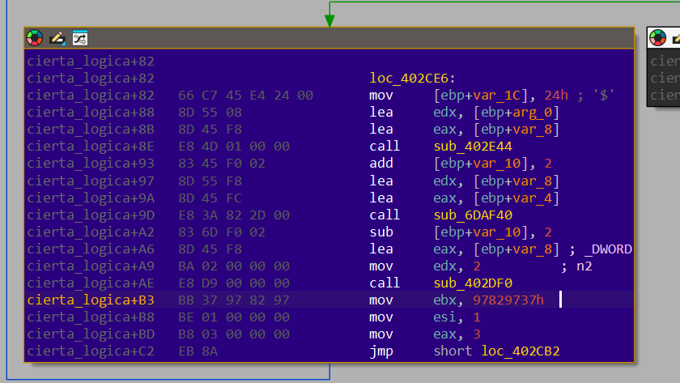
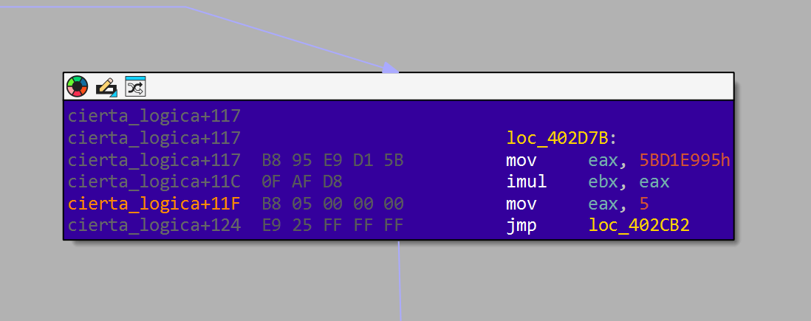
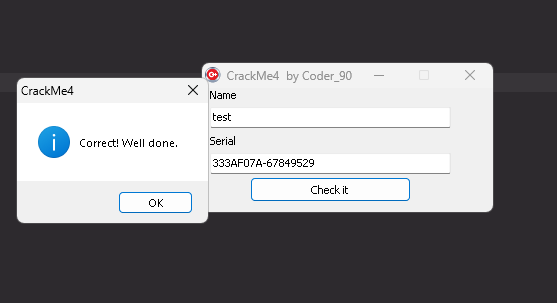

# Coder_90's CrackMe4 - Reverse Engineering Analysis

**Challenge URL:** https://crackmes.one/crackme/6969e9e3e3ae2054ed59d494

**Difficulty:** Medium

**Platform:** Windows (Delphi)

**Author:** Coder_90

---

## TL;DR

This crackme challenge presents a Delphi-compiled Windows executable that implements a name/serial validation scheme using a custom hash function. The application requires users to input a name and a corresponding serial number. The serial is validated by computing two 32-bit hashes of the username using a modified MurmurHash-style algorithm with a fixed seed and a derived seed.

**Key Findings:**
- The executable is compiled with Borland Delphi, utilizing Unicode strings (UTF-16LE on Windows)
- Serial format: `HASH1-HASH2` (two 8-digit hexadecimal values separated by a hyphen)
- The hash function uses constants: initial value `0x97829737`, multiplier `0x5BD1E995`, and base seed `0x55AA55AA`
- A working keygen has been developed and validated

---

## Initial Analysis

### Binary Signature Analysis

The executable was first analyzed using DiE (Detect It Easy) to identify the compiler and packing status:


**Findings:**
- **Compiler:** Borland Delphi
- **Linker:** Turbo Linker v6.0
- **Packing:** None detected
- **Architecture:** 32-bit (x86)
- **Entry Point:** Standard Delphi initialization code

Delphi binaries present unique challenges in reverse engineering due to:
1. Heavy use of the VCL (Visual Component Library) framework
2. Unicode string management (typically UTF-16LE)
3. Reference-counted memory management
4. Complex initialization sequences
5. Extensive runtime library calls

### Static Analysis Setup

The binary was loaded into IDA Pro for disassembly and decompilation. Key focus areas:
- Event handlers for UI controls (button clicks)
- String comparison functions
- Hash/checksum calculation routines

---

## Decompilation Analysis

### Main Validation Function


The core validation logic resides in the function identified as `funcion_serial_key` at address `0x00402XXX`. The decompiled pseudocode reveals the following structure:

```cpp
void __fastcall funcion_serial_key(int a1)
{
  System::Sysutils *n1437226410; // esi - First hash result
  System::Sysutils *v3;          // edi - Second hash result
  int serial_key;                // User-provided serial
  char name[4];                  // User-provided name

  // Get the name input from UI control
  Vcl::Controls::TControl::GetText(*(Vcl::Controls::TControl **)(a1 + 940));
  
  // Get the serial input from UI control  
  Vcl::Controls::TControl::GetText(*(Vcl::Controls::TControl **)(a1 + 944));
  
  if (*(_DWORD *)name && serial_key)
  {
    // Compute first hash: hash(name, 0x55AA55AA)
    n1437226410 = (System::Sysutils *)sub_402C64(name[0], 1437226410);
    
    // Compute second hash: hash(name, first_hash)
    v3 = (System::Sysutils *)sub_402C64(name[0], (int)n1437226410);
    
    // Convert hashes to hex strings
    System::Sysutils::IntToHex(v3, 8, v4);          // v9 = hex(hash2)
    System::Sysutils::IntToHex(n1437226410, 8, v5); // v12 = hex(hash1)
    
    // Build expected serial string and compare
    // Expected format: hash1_hex + "-" + hash2_hex
    
    if (serial_matches_expected)
    {
      // Success: Flash green and show success message
      sub_6590E0(a1, 65280); // Green color (0x00FF00)
      Sleep(200);
      reset_form();
    }
    else
    {
      // Failure: Shake the window
      for (i = 0; i < 6; ++i)
      {
        if (i % 2)
          sub_6276FC(a1, v7 - 10);
        else
          sub_6276FC(a1, v7 + 10);
        Sleep(40);
      }
      reset_form();
    }
  }
}
```

**Key Observations:**
1. The constant `1437226410` (decimal) equals `0x55AA55AA` (hexadecimal) - this is the initial seed
2. Two hashes are computed: one with a fixed seed, another using the first hash as the seed
3. The serial format includes a separator (likely a hyphen based on the string constant)
4. Success triggers a visual feedback (green flash), failure causes window shake animation

---

## Hash Function Analysis

### Decompiled Pseudocode

The hash function at `sub_402C64` (renamed to `cierta_logica` during analysis) implements a state machine-based hashing algorithm:

```cpp
unsigned int __cdecl cierta_logica(int a1, int seed)
{
  unsigned int v2;  // ebx - Hash accumulator
  int state;        // eax - State machine variable
  int index;        // esi - Character index (1-based)
  int length;       // ecx - String length

  v2 = 0;
  state = 0;
  index = 1;
  
  while (true)
  {
    switch (state)
    {
      case 0: // Initialization
        v2 = 0x977EBA67; // INCORRECT VALUE FROM DECOMPILER
        index = 1;
        state = 3;
        break;
        
      case 3: // Check if more characters to process
        if (index > length)
          state = 99; // Exit
        else
          state = 4;  // Process next character
        break;
        
      case 4: // Get character and XOR
        v2 ^= string[index];
        state = 2;
        break;
        
      case 2: // Multiply
        v2 *= 1540483477;
        state = 5;
        break;
        
      case 5: // Rotate left 5 bits
        v2 = (v2 >> 27) | (v2 << 5);
        state = 1;
        break;
        
      case 1: // XOR with seed and advance
        v2 ^= seed;
        ++index;
        state = 3;
        break;
        
      case 99: // Return result
        return v2;
    }
  }
}
```

### Critical Issue: Decompiler Inaccuracy

The decompiled pseudocode shows an initialization value of `0x977EBA67` (signed: `-1753049289`). However, **this is incorrect**. The decompiler misinterpreted the actual assembly instruction.

### Assembly Code Analysis

To obtain the correct values, we must examine the raw assembly code. The critical section is in the initialization state:

```nasm
.text:00402C64  cierta_logica   proc near
...
.text:00402CE6  loc_402CE6:                    ; Initialization (state 0)
...
.text:00402D17                  mov     ebx, 97829737h  ;CORRECT INITIAL VALUE
.text:00402D1C                  mov     esi, 1
.text:00402D21                  mov     eax, 3
.text:00402D26                  jmp     loc_402CB2
```

**Location:** `cierta_logica+B3` (offset `0xB3` from function start)  
**Address:** `0x00402D17`

And the multiplication constant:

```nasm
.text:00402D7B  loc_402D7B:                    ; Multiplication (state 2)
.text:00402D7B                  mov     eax, 5BD1E995h  ; MULTIPLICATION CONSTANT
.text:00402D80                  imul    ebx, eax
.text:00402D83                  mov     eax, 5
.text:00402D88                  jmp     loc_402CB2
```

**Correct Constants:**
- **Initial value:** `0x97829737` (decimal: `2541918007`)
- **Multiplication constant:** `0x5BD1E995` (decimal: `1540483477`)
- **Initial seed:** `0x55AA55AA` (decimal: `1437226410`)

### Hash Algorithm Flow

For each character in the input string, the algorithm performs:

1. **XOR with character byte:** `hash ^= char_value`
2. **Multiply by constant:** `hash *= 0x5BD1E995`
3. **Rotate left 5 bits:** `hash = ROL(hash, 5)`
4. **XOR with seed:** `hash ^= seed`

This process repeats for every character, and the final 32-bit value is returned.

The rotation operation is implemented as:
```cpp
uint32_t rotl32(uint32_t value, unsigned int shift)
{
    return (value << shift) | (value >> (32 - shift));
}
```

---

## Serial Generation Algorithm

### Two-Stage Hashing

The serial is generated using a two-stage process:

1. **First Hash (H1):**
   - Input: User's name
   - Seed: `0x55AA55AA` (fixed constant)
   - Output: 32-bit hash value

2. **Second Hash (H2):**
   - Input: User's name (same as H1)
   - Seed: Result from H1
   - Output: 32-bit hash value

### Serial Format

The final serial is constructed as:
```
SERIAL = sprintf("%08X-%08X", H1, H2)
```

Where:
- `%08X` formats the hash as 8-digit uppercase hexadecimal
- The hyphen (`-`) is the separator
- No spaces or additional characters

**Example:**
- Name: `test`
- H1: `0x333AF07A`
- H2: `0x67849529`
- Serial: `333AF07A-67849529`

---

## String Encoding Considerations

### Delphi Unicode Strings

Delphi applications typically use Unicode strings with UTF-16LE encoding. However, testing revealed that this implementation processes strings as **single-byte characters** (likely ANSI or the first byte of each UTF-16 character pair).

**Testing different encodings:**

| Encoding | Name: "test" | H1 | H2 | Serial |
|----------|--------------|----|----|--------|
| UTF-8 / ANSI | `0x74 0x65 0x73 0x74` | `0x333AF07A` | `0x67849529` | `333AF07A-67849529` ✅ |
| UTF-16LE | `0x74 0x00 0x65 0x00 0x73 0x00 0x74 0x00` | `0xB47B36E0` | `0x429A7CCF` | `B47B36E0-429A7CCF` ❌ |

The working implementation uses single-byte character encoding.

---

## Keygen Implementation

### Python Implementation

```python
#!/usr/bin/env python3

def rol32(value, shift):
    """Rotate a 32-bit value left by shift bits."""
    return ((value << shift) | (value >> (32 - shift))) & 0xFFFFFFFF

def hash_func(name, seed):
    """
    Custom hash function using MurmurHash-inspired algorithm.
    
    Args:
        name: Input string to hash
        seed: 32-bit seed value
        
    Returns:
        32-bit hash value
    """
    r = 0x97829737  # Initial hash value
    
    # Process each character (1-indexed like Delphi)
    for i in range(1, len(name) + 1):
        char_value = ord(name[i - 1])
        
        # Hash update sequence
        r ^= char_value              # XOR with character
        r = (r * 0x5BD1E995) & 0xFFFFFFFF  # Multiply (with 32-bit wrap)
        r = rol32(r, 5)              # Rotate left 5 bits
        r ^= seed                    # XOR with seed
    
    return r

def generate_serial(name):
    """
    Generate a valid serial for the given name.
    
    Args:
        name: Username string
        
    Returns:
        Serial in format XXXXXXXX-XXXXXXXX
    """
    # First hash with fixed seed
    h1 = hash_func(name, 0x55AA55AA)
    
    # Second hash using first hash as seed
    h2 = hash_func(name, h1)
    
    # Format as uppercase hex with hyphen separator
    return f"{h1:08X}-{h2:08X}"

def main():
    import sys
    
    if len(sys.argv) > 1:
        # Name provided as command-line argument
        name = ' '.join(sys.argv[1:])
    else:
        # Interactive mode
        name = input("Name: ").strip()
    
    if name:
        serial = generate_serial(name)
        print(f"\nName:   {name}")
        print(f"Serial: {serial}")
    else:
        print("Error: Name cannot be empty")

if __name__ == "__main__":
    main()
```

---

### Success Screen

When a correct serial is entered, the application displays a success message:




## Reverse Engineering Methodology

### Tools Used

1. **DiE (Detect It Easy)** - Initial binary analysis and compiler detection
2. **IDA Pro** - Disassembly and decompilation
3. **x64dbg** - Dynamic analysis and debugging (optional)
4. **Python 3** - Keygen development and testing

### Analysis Steps

1. **Reconnaissance:**
   - Identify compiler and protection mechanisms
   - Locate UI event handlers
   - Map string references

2. **Static Analysis:**
   - Decompile validation function
   - Identify hash algorithm
   - Trace data flow

3. **Dynamic Analysis (if needed):**
   - Set breakpoints on comparison functions
   - Monitor hash computation
   - Observe success/failure paths

4. **Algorithm Extraction:**
   - Convert decompiled code to clean pseudocode
   - Verify constants via assembly inspection
   - Handle decompiler inaccuracies

5. **Keygen Development:**
   - Implement hash function in Python/C++
   - Test with known inputs
   - Validate against the actual binary

6. **Documentation:**
   - Create detailed technical report
   - Include code samples and screenshots
   - Document all findings

---

